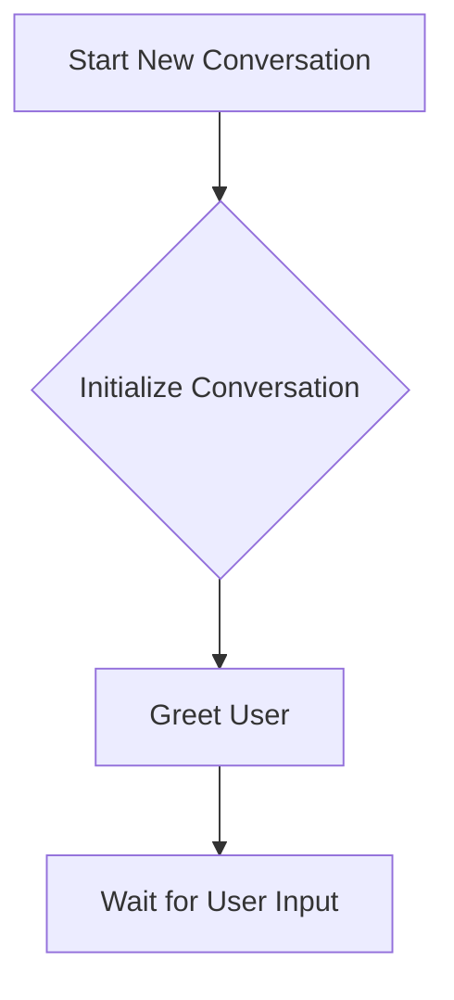

# Conversation Flow Documentation

This document provides a comprehensive overview of the conversation system's architecture and flow within the Enterprise RAG (Retrieval-Augmented Generation) system. It is designed for a newbie to understand how user interactions are processed, from initial input to generating a response.

## 1. Introduction to the Conversation System

The conversation system is the brain behind the AI assistant's ability to understand user queries, retrieve relevant information, and generate coherent responses. It manages the entire lifecycle of a conversation, ensuring context is maintained, intents are understood, and appropriate actions are taken.

## 2. Core Components

The system is built upon several interconnected Python classes, each responsible for a specific aspect of the conversation:

*   **`FreshConversationGraph`**: This is the orchestrator. It defines the sequence of steps (nodes) a conversation follows and manages the transitions between them. It's like a flowchart that the conversation navigates.
*   **`FreshConversationNodes`**: These are the individual "action points" or steps within the conversation flow. Each node performs a specific task, such as understanding intent, searching for knowledge, or generating a response.
*   **`FreshConversationState`**: This is the central data structure that holds all information about the current conversation. It's a dynamic dictionary that gets updated as the conversation progresses, carrying context, messages, search results, and more.
*   **`FreshContextManager`**: Responsible for managing external context and detecting potential "context poisoning" (malicious attempts to manipulate the AI's behavior). It ensures the AI operates within its intended boundaries.
*   **`FreshMemoryManager`**: Handles different types of memory (short-term, long-term, working memory) to help the AI recall past interactions and relevant information efficiently.
*   **`FreshSmartRouter`**: Analyzes user queries to determine their intent (e.g., greeting, question, command) and complexity. It guides the `FreshConversationGraph` on which path to take next.

## 3. High-Level Conversation Flow

The conversation flow can be broadly divided into two main scenarios: starting a new conversation and continuing an existing one.

### 3.1. Starting a New Conversation

When a user initiates a conversation without providing a `thread_id`, the system performs the following steps:

1.  **Initialize**: A new `FreshConversationState` is created with a unique `thread_id`.
2.  **Greet**: The system generates and sends a welcoming message to the user.
3.  **Wait for Input**: The system then waits for the user's first message.



### 3.2. Handling a User Message (Continuing Conversation)

When a user sends a message (either as the first message or to continue an existing conversation), the system processes it through a series of nodes:

1.  **Receive Message**: The user's message is added to the `FreshConversationState`.
2.  **Understand Intent**: The `FreshSmartRouter` analyzes the message to determine the user's intent and other characteristics.
3.  **Route**: Based on the intent, the `FreshConversationGraph` decides the next appropriate action (e.g., search for knowledge, generate a direct response, or end the conversation).
4.  **Execute Node**: The chosen node (e.g., `search_knowledge`, `generate_response`) performs its specific task.
5.  **Respond/Loop**: The system generates a response, and if the conversation is not ending, it returns to the "Wait for Input" state.

```mermaid
```

## 4. Detailed Node Descriptions (`FreshConversationNodes`)

Each node in the `FreshConversationNodes` class performs a critical function:

*   **`initialize_conversation(state)`**:
    *   **Purpose**: Sets up the initial state for a new conversation.
    *   **Actions**: Assigns a unique `thread_id`, sets `conversation_status` to 'active', initializes `turn_count` to 0, and records creation timestamps.
*   **`greet_user(state)`**:
    *   **Purpose**: Crafts and adds a welcoming message from the AI assistant to the conversation history.
    *   **Actions**: Appends a standard greeting like "Hello! I'm your AI assistant. How can I help you today?" to the `messages` list in the state.
*   **`understand_intent(state)`**:
    *   **Purpose**: Analyzes the user's latest message to determine their intent, complexity, and whether it's contextual.
    *   **Actions**:
        *   Extracts the latest user message.
        *   Utilizes `FreshSmartRouter.analyze_query()` to get `QueryAnalysis` (intent, complexity, keywords, entities, `is_contextual`).
        *   If `is_contextual` is true, it uses the `llm_client` and recent conversation history to generate an `enhanced_query` for better search results.
        *   Updates the `FreshConversationState` with `user_intent`, `query_complexity`, `entities_mentioned`, `is_contextual`, and `processed_query`.

    ```mermaid
    graph TD
        A[User Message] --> B{Extract Latest Query};
        B --> C{Analyze Query (FreshSmartRouter)};
        C --&gt; D{Is Query Contextual?};
        D -- Yes --> E[Generate Enhanced Query with LLM & History];
        D -- No --> F[Use Original Query as Processed Query];
        E --> G[Update State with Analysis & Processed Query];
        F --> G;
    ```

*   **`search_knowledge(state)`**:
    *   **Purpose**: Executes a search against the knowledge base (via `QueryEngine`) using multiple strategies to find the most relevant information.
    *   **Actions**:
        *   Retrieves `processed_query`, `original_query`, and `is_contextual` from the state.
        *   **Multi-Strategy Search**:
            *   If `is_contextual`, it first tries searching with the `processed_query`.
            *   If results are insufficient, it falls back to the `original_query`.
            *   If still no results, it attempts a search based on extracted entities/keywords.
            *   For non-contextual queries, it performs a standard search.
            *   Includes special handling for aggregation queries (e.g., "how many incidents") by calling `query_engine.count_documents`.
        *   Stores all search attempts for debugging.
        *   Populates `search_results` (list of `SearchResult` objects) and `context_chunks` in the state.

    ```mermaid
    graph TD
        A[Processed Query] --> B{Check for Aggregation Query};
        B -- Yes --> C[Perform Aggregation (e.g., count_documents)];
        B -- No --> D{Is Query Contextual?};

        D -- Yes --> E[Attempt Search with Processed Query];
        E -- Insufficient Results --> F[Attempt Search with Original Query];
        F -- Insufficient Results --> G[Attempt Search with Extracted Topic/Entities];
        G --> H[Store Search Results & Context Chunks];

        D -- No --> I[Perform Standard Search];
        I --> H;
        C --> J[Update State with Aggregation Result];
        J --> K[Skip LLM Response Generation];
    ```

*   **`generate_response(state)`**:
    *   **Purpose**: Crafts the final response to the user based on the gathered information and intent.
    *   **Actions**:
        *   If an `aggregation_result` is present (from `search_knowledge`), it generates a direct, concise response (e.g., "There are X incidents.").
        *   For other intents:
            *   If `user_intent` is "goodbye", "greeting", or "help", it provides a predefined response.
            *   Otherwise, if `llm_client` and `context_chunks` are available, it constructs a detailed prompt for the LLM, including the context, and generates a comprehensive answer.
            *   If no LLM or context, it falls back to a direct response from the first search result or a "no information found" message.
        *   Adds the generated response to the `messages` list in the state.
*   **`handle_clarification(state)`**:
    *   **Purpose**: Provides a message to the user when the system needs more information or the query is unclear.
    *   **Actions**: Appends a clarification message like "I'm not sure I understood your question. Could you please provide more details or rephrase it?" to the state.

## 5. Key Concepts

### 5.1. Intent Detection (`FreshSmartRouter`)

The `FreshSmartRouter` uses pattern matching and heuristics to classify the user's query into various intents (e.g., `GREETING`, `GOODBYE`, `INFORMATION_SEEKING`, `COMMAND`). This classification is crucial for directing the conversation flow to the appropriate node.

### 5.2. Contextual Queries

The system can detect if a user's query is "contextual," meaning it refers to previous turns in the conversation (e.g., "What about that?"). If detected, the `understand_intent` node uses the `llm_client` to generate an "enhanced query" that incorporates the historical context, leading to more accurate search results.

### 5.3. Multi-Strategy Search

To ensure robust information retrieval, the `search_knowledge` node employs a multi-strategy approach. It tries different query formulations (processed, original, topic-based) and prioritizes results to maximize the chances of finding relevant information, especially for complex or ambiguous queries.

### 5.4. Context Poisoning Detection (`FreshContextManager`)

The `FreshContextManager` includes logic to identify and prevent "context poisoning." This is a security measure to detect attempts by users to manipulate the AI's behavior or inject harmful instructions by looking for specific keywords or patterns in the input.

### 5.5. Memory Management (`FreshMemoryManager`)

The `FreshMemoryManager` maintains different types of memory:

*   **Short-Term Memory**: For recent interactions, quickly accessible.
*   **Long-Term Memory**: For more persistent information, like user preferences or common topics.
*   **Working Memory**: For temporary information relevant to the current task.

This tiered approach helps the AI maintain coherence and relevance throughout longer conversations.

## 6. API Endpoints (`rag_new/rag_system/src/api/routes/conversation.py`)

The conversation system exposes the following API endpoints:

*   **`POST /conversation`**:
    *   **Purpose**: Starts a new conversation or continues an existing one.
    *   **Request**: `ConversationRequest` (optional `thread_id`, optional `message`).
    *   **Response**: `ConversationResponse` (includes `thread_id`, `response`, `suggestions`, `sources`, `turn_count`, `phase`).
*   **`GET /conversation/history/{thread_id}`**:
    *   **Purpose**: Retrieves the message history for a given conversation thread.
    *   **Response**: JSON object with `thread_id`, `conversation_id`, `messages`, and `turn_count`.
*   **`GET /conversation/health`**:
    *   **Purpose**: Provides a health check for the conversation service, indicating its status and capabilities.
    *   **Response**: JSON object with service status, manager type, version, and feature details.

This documentation should provide a solid foundation for understanding the conversation flow within the Enterprise RAG system.
