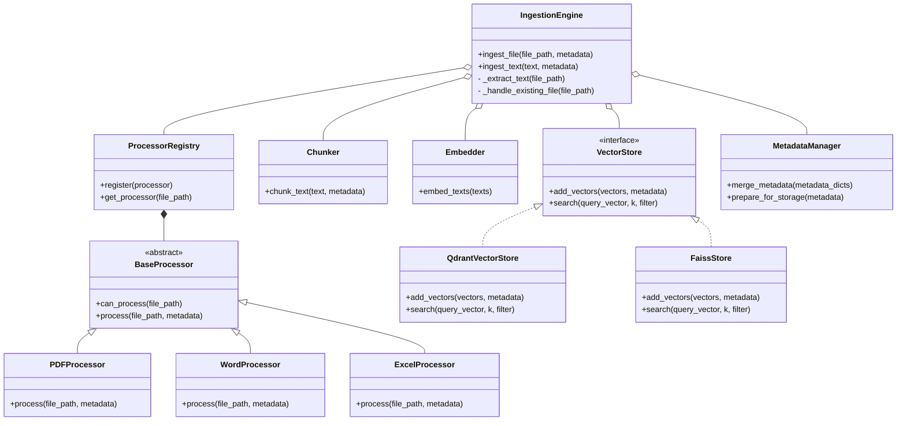

# Document Ingestion Pipeline

This document outlines the architecture and workflow of the document ingestion pipeline for the RAG system. The primary goal of this pipeline is to process various unstructured and structured documents, extract their content, convert it into searchable vector embeddings, and store them efficiently for retrieval.

## 1. High-Level Overview

The ingestion process can be summarized in four main stages: Upload, Process, Embed, and Store. A user or an automated system initiates the process by providing a document. The system then processes the document to extract its core content, which is then transformed into numerical vectors (embeddings) and stored in a specialized database for fast and semantic searching.


## 2. Detailed Ingestion Flow

The system is designed to handle multiple document types by routing them to specialized processors. A central controller first identifies the file type and then dispatches it to the appropriate content extraction module. After extraction, the raw text is standardized and passed through a common pipeline for chunking, embedding, and storage.

```mermaid
graph TD;
    subgraph Input
        A[Upload via API/UI]
    end

    subgraph Processing Pipeline
        A --> B{Identify File Type};
        B -->|PDF| C[PDF Processor <br> (PyPDF2 / Azure DI)];
        B -->|Word| D[Word Processor <br> (python-docx)];
        B -->|Excel| E[Excel Processor <br> (openpyxl)];
        B -->|Text/Other| F[Text Processor];
        
        C --> G[Extracted Text];
        D --> G;
        E --> G;
        F --> G;
    end

    subgraph Core RAG Engine
        G --> H[Chunk Content];
        H --> I[Generate Vector Embeddings <br> (SentenceTransformers/Cohere)];
        I --> J{Store Data};
    end

    subgraph Storage Layer
        J --> K[Vector Database <br> (Qdrant / FAISS)];
        J --> L[Metadata Store];
    end

    K --> M[Indexed & Searchable];
    L --> M;
```

## 3. Core Processing Stages Explained

### 3.1. File Identification
- **Method**: The pipeline uses file extensions (`.pdf`, `.docx`, etc.) and the `python-magic` library to accurately determine the MIME type of the incoming file. This ensures the correct processor is used.

### 3.2. Content Extraction
- **PDFs**: For standard PDFs, `PyPDF2` is used for text extraction. For complex PDFs with images or tables, the system can leverage the **Azure Document Intelligence** service for higher-fidelity optical character recognition (OCR) and layout analysis.
- **Word Documents**: `python-docx` is used to extract text, tables, and other content from `.docx` files.
- **Excel Spreadsheets**: `openpyxl` and `xlrd` handle `.xlsx` and `.xls` files, respectively. The pipeline is configured to extract data from relevant sheets and cells, often converting tabular data into a textual format.
- **Plain Text**: For `.txt`, `.md`, or other text-based formats, the content is read directly.

### 3.3. Text Chunking
- **Purpose**: Raw extracted text is often too long to be processed by embedding models effectively. The text is split into smaller, semantically coherent chunks.
- **Method**: The system uses a text splitter (e.g., from LangChain) that breaks text by paragraphs, sentences, or a fixed token count, ensuring that context is preserved within each chunk.

### 3.4. Vector Embedding
- **Purpose**: Each text chunk is converted into a high-dimensional numerical vector. These embeddings capture the semantic meaning of the text, allowing for similarity-based searches.
- **Models**: The system is flexible and can use various embedding models, including open-source `sentence-transformers` or powerful commercial models from `Cohere` and `OpenAI`.

## 4. Storage and Metadata Architecture

To ensure data integrity and efficient retrieval, the system uses a dual-storage mechanism. The vector embeddings are kept in a specialized vector database, while the corresponding text and metadata are stored in a separate, linked database.

```mermaid
graph TD;
    subgraph Embedding Generation
        A[Text Chunk] --> B(Embedding Model);
        B --> C[Embedding Vector];
    end

    subgraph Metadata Creation
        D[Original Document Info <br> (e.g., filename.pdf)] --> E{Metadata Object};
        A --> E;
        E --> F[Chunk Metadata <br> (doc_id, chunk_id, text)];
    end

    subgraph Storage
        C --> G[Vector Database <br> (Qdrant / FAISS)];
        F --> H[Metadata Store <br> (e.g., SQLite, JSON file)];
    end

    subgraph Linking
        G -- "vector_id" --> I{Link};
        H -- "metadata_id" --> I;
        I --> J[Retrieval Possible];
    end
```

- **Vector Database**: The system was initially built on `faiss-cpu` for its speed and simplicity. It has since been upgraded to support `Qdrant`, which offers more robust features like persistent storage, advanced filtering, and easier metadata management directly within the vector store.
- **Metadata Store**: A separate store (which could be a simple database like SQLite or even structured JSON files) holds the actual text of each chunk, its position within the original document, and the source document's name. This allows the system to retrieve the exact source text after finding relevant vectors.

## 5. Class and Method Level Detail

The following diagram illustrates the key classes and their interactions within the ingestion pipeline.



### Class Descriptions

*   **IngestionEngine**: The central orchestrator of the ingestion process. It takes a file or text, determines how to process it, and coordinates the other components.
*   **ProcessorRegistry**: Holds a list of available document processors (e.g., for PDF, Word, Excel) and provides the correct one based on the file type.
*   **BaseProcessor**: An abstract base class that defines the interface for all document processors. Each specific processor (like `PDFProcessor`) implements this interface.
*   **Chunker**: Responsible for splitting the extracted text into smaller, manageable chunks suitable for the embedding model.
*   **Embedder**: Converts the text chunks into numerical vector embeddings using a chosen model (e.g., SentenceTransformers, Cohere).
*   **VectorStore**: An interface for the vector database. It defines methods for adding and searching vectors.
*   **QdrantVectorStore / FaissStore**: Concrete implementations of the `VectorStore` interface, using Qdrant and FAISS respectively.
*   **MetadataManager**: A utility class for creating, validating, and merging metadata associated with the documents and chunks.

## 6. Ingestion Sequence Diagram

This diagram shows the sequence of interactions between the different components during the ingestion of a single file.


