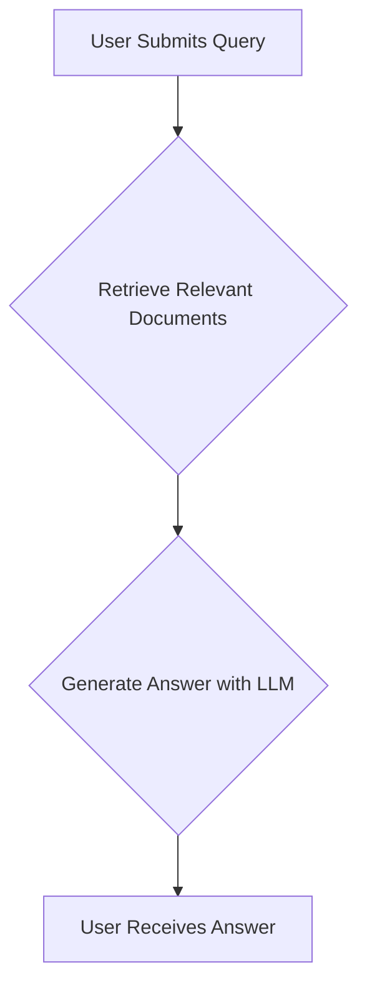
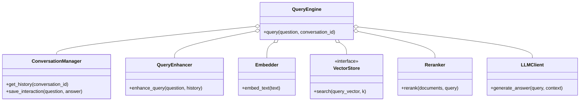
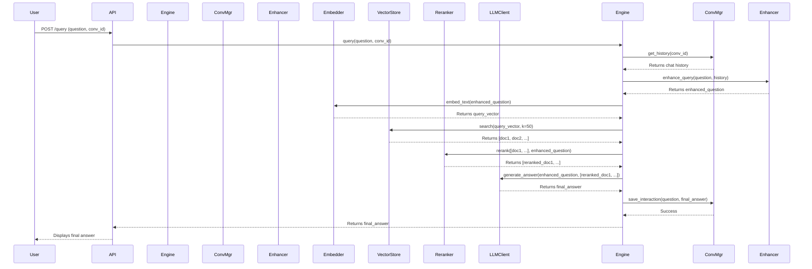

# Query and Retrieval Pipeline

This document details the architecture and workflow for how the RAG system processes user queries to retrieve relevant information and generate accurate, context-aware answers.

## 1. High-Level Overview

The query process transforms a user's question into a format the system can understand, searches for relevant information in the vector database, and then uses a Large Language Model (LLM) to synthesize an answer from the retrieved context.



## 2. Detailed Query Flow

The query pipeline involves several sophisticated steps to ensure the highest quality response. This includes understanding the conversational context, enhancing the query, retrieving and re-ranking documents, and finally, generating a coherent answer.

```mermaid
graph TD;
    subgraph User Input
        A[User Query via API/UI]
    end

    subgraph Query Processing
        A --> B[Conversation Manager <br> (Load Chat History)];
        B --> C[Query Enhancer <br> (Rewrite query with context)];
        C --> D[Enhanced Query];
    end

    subgraph Core RAG Engine
        D --> E[Embedder <br> (Generate Query Vector)];
        E --> F[Vector Store <br> (Similarity Search)];
        F --> G[Retrieved Document Chunks];
        G --> H[Reranker <br> (Optimize chunk relevance)];
        H --> I[Finalized Context];
    end

    subgraph Response Generation
        I --> J[LLM Client <br> (Generate answer from context)];
        D --> J;
        J --> K[Generated Answer];
        K --> L[Conversation Manager <br> (Save new interaction)];
    end

    L --> M[Return Answer to User];
```

## 3. Core Processing Stages Explained

### 3.1. Query Enhancement
- **Purpose**: A user's raw query (e.g., "What about the second one?") might be ambiguous without context. This stage uses the conversation history to create a more specific, standalone query (e.g., "What is the status of incident INC001002?").
- **Method**: The system retrieves the recent chat history and uses an LLM to rewrite the user's latest query into a clear, self-contained question.

### 3.2. Vector Search (Retrieval)
- **Purpose**: To find the most relevant document chunks from the knowledge base that are likely to contain the answer to the user's query.
- **Method**: The enhanced query is converted into a vector embedding. This query vector is then used to perform a similarity search against the millions of vectors in the `Qdrant` or `FAISS` vector store. The top `k` most similar vectors (and their corresponding text chunks) are returned.

### 3.3. Re-ranking
- **Purpose**: The initial retrieval is based on vector similarity, which is fast but not always perfect. The re-ranking step uses a more sophisticated model to re-order the retrieved chunks, pushing the most relevant ones to the top.
- **Method**: A cross-encoder model or a powerful LLM evaluates the relevance of each retrieved chunk against the query and assigns a new, more accurate relevance score. The chunks are then sorted based on this new score.

### 3.4. Answer Generation
- **Purpose**: To synthesize a final, human-readable answer based on the evidence found in the retrieved documents.
- **Method**: The original query and the top-ranked, re-ordered document chunks are combined into a single prompt. This prompt is sent to a powerful LLM (like GPT-4, Claude, or Groq), which generates a final answer, citing sources from the provided context.

## 4. Class and Method Level Detail

The following diagram illustrates the key classes and their interactions within the query pipeline.



### Class Descriptions

*   **QueryEngine**: The main orchestrator for handling a user query. It coordinates all other components to generate a final answer.
*   **ConversationManager**: Manages the state of a conversation, including loading history and saving new question-answer pairs.
*   **QueryEnhancer**: Rewrites a user's query using conversational context to make it more precise for the retrieval system.
*   **Embedder**: Converts the enhanced text query into a vector embedding.
*   **VectorStore**: The interface to the vector database (`Qdrant` or `FAISS`), used to search for relevant document chunks.
*   **Reranker**: Improves the ordering of retrieved documents to ensure the most relevant context is passed to the LLM.
*   **LLMClient**: Interacts with the final Large Language Model to generate a human-readable answer from the given query and context.

## 5. Query Sequence Diagram

This diagram shows the detailed sequence of interactions when a user asks a question.


