# RAG System Class Interaction Diagram

```mermaid
graph TD
    %% Core Components
    DependencyContainer["DependencyContainer\n(Core)"]
    ConfigManager["ConfigManager\n(Core)"]
    JSONStore["JSONStore\n(Core)"]
    SystemInit["SystemInit\n(Core)"]
    
    %% Storage Components
    FAISSStore["FAISSStore\n(Storage)"]
    MetadataStore["PersistentJSONMetadataStore\n(Storage)"]
    
    %% Ingestion Components
    IngestionEngine["IngestionEngine\n(Ingestion)"]
    Chunker["Chunker\n(Ingestion)"]
    Embedder["Embedder\n(Ingestion)"]
    ProcessorRegistry["ProcessorRegistry\n(Ingestion)"]
    
    %% Retrieval Components
    QueryEngine["QueryEngine\n(Retrieval)"]
    LLMClient["LLMClient\n(Retrieval)"]
    Reranker["Reranker\n(Retrieval)"]
    QueryEnhancer["QueryEnhancer\n(Retrieval)"]
    
    %% Integration Components
    ServiceNowIntegration["ServiceNowIntegration\n(Integrations)"]
    AzureAIClient["AzureAIClient\n(Integrations)"]
    
    %% Dependencies and Relationships
    
    %% DependencyContainer manages all components
    DependencyContainer -->|registers| ConfigManager
    DependencyContainer -->|registers| JSONStore
    DependencyContainer -->|registers| FAISSStore
    DependencyContainer -->|registers| MetadataStore
    DependencyContainer -->|registers| Embedder
    DependencyContainer -->|registers| Chunker
    DependencyContainer -->|registers| LLMClient
    DependencyContainer -->|registers| Reranker
    DependencyContainer -->|registers| QueryEnhancer
    DependencyContainer -->|registers| QueryEngine
    DependencyContainer -->|registers| IngestionEngine
    DependencyContainer -->|registers| ServiceNowIntegration
    
    %% SystemInit initializes the container
    SystemInit -->|initializes| DependencyContainer
    
    %% IngestionEngine dependencies
    IngestionEngine -->|uses| Chunker
    IngestionEngine -->|uses| Embedder
    IngestionEngine -->|uses| FAISSStore
    IngestionEngine -->|uses| MetadataStore
    IngestionEngine -->|uses| ConfigManager
    IngestionEngine -->|manages| ProcessorRegistry
    
    %% QueryEngine dependencies
    QueryEngine -->|uses| FAISSStore
    QueryEngine -->|uses| Embedder
    QueryEngine -->|uses| LLMClient
    QueryEngine -->|uses| MetadataStore
    QueryEngine -->|uses| ConfigManager
    QueryEngine -->|uses| Reranker
    QueryEngine -->|uses| QueryEnhancer
    
    %% Integration dependencies
    ServiceNowIntegration -->|uses| IngestionEngine
    ServiceNowIntegration -->|uses| ConfigManager
    
    %% Storage relationships
    FAISSStore -->|stores| Embedder
    MetadataStore -->|stores metadata for| FAISSStore
    
    %% Optional integrations
    IngestionEngine -.->|may use| AzureAIClient
    
    %% Data flow for document ingestion
    subgraph "Document Ingestion Flow"
        direction LR
        Doc[Document] -->|1. Process| IngestionEngine
        IngestionEngine -->|2. Chunk| Chunker
        Chunker -->|3. Return chunks| IngestionEngine
        IngestionEngine -->|4. Embed chunks| Embedder
        Embedder -->|5. Return embeddings| IngestionEngine
        IngestionEngine -->|6. Store vectors| FAISSStore
        IngestionEngine -->|7. Store metadata| MetadataStore
    end
    
    %% Data flow for query processing
    subgraph "Query Processing Flow"
        direction LR
        Query[User Query] -->|1. Process| QueryEngine
        QueryEngine -->|2. Enhance query| QueryEnhancer
        QueryEnhancer -->|3. Return enhanced query| QueryEngine
        QueryEngine -->|4. Embed query| Embedder
        Embedder -->|5. Return embedding| QueryEngine
        QueryEngine -->|6. Search vectors| FAISSStore
        FAISSStore -->|7. Return results| QueryEngine
        QueryEngine -->|8. Rerank results| Reranker
        Reranker -->|9. Return reranked results| QueryEngine
        QueryEngine -->|10. Generate response| LLMClient
        LLMClient -->|11. Return response| QueryEngine
    end
```

## Key Component Descriptions

### Core Components
- **DependencyContainer**: Central dependency injection container that manages all system components and their dependencies
- **ConfigManager**: Manages system configuration settings
- **JSONStore**: Simple JSON-based data store for persistent storage
- **SystemInit**: Initializes the RAG system and its components

### Storage Components
- **FAISSStore**: Vector database using FAISS for efficient similarity search
- **PersistentJSONMetadataStore**: Stores metadata about documents and chunks

### Ingestion Components
- **IngestionEngine**: Main engine for processing and ingesting documents
- **Chunker**: Splits documents into manageable chunks
- **Embedder**: Converts text into vector embeddings
- **ProcessorRegistry**: Registry of document processors for different file types

### Retrieval Components
- **QueryEngine**: Main engine for processing user queries and generating responses
- **LLMClient**: Client for interacting with language models
- **Reranker**: Reranks search results for better relevance
- **QueryEnhancer**: Enhances user queries for better search results

### Integration Components
- **ServiceNowIntegration**: Integration with ServiceNow
- **AzureAIClient**: Integration with Azure AI services

## Main Workflows

### Document Ingestion Workflow
1. IngestionEngine receives a document
2. Document is processed by appropriate processor from ProcessorRegistry
3. Chunker splits the document into chunks
4. Embedder converts chunks to vector embeddings
5. FAISSStore stores the vector embeddings
6. MetadataStore stores metadata about the document and chunks

### Query Processing Workflow
1. QueryEngine receives a user query
2. QueryEnhancer enhances the query (if enabled)
3. Embedder converts the query to a vector embedding
4. FAISSStore searches for similar vectors
5. Reranker reranks the results (if enabled)
6. LLMClient generates a response using the retrieved context
7. QueryEngine returns the response with sources
