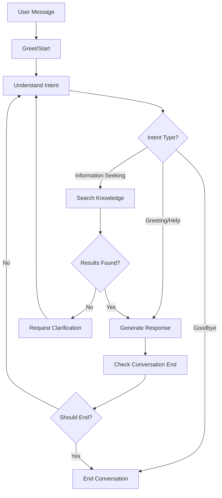

# src/conversation/__init__.py
"""
Conversation Management Package
LangGraph-based conversational flow for the RAG system
"""

from .conversation_manager import ConversationManager
from .conversation_graph import ConversationGraph
from .conversation_state import ConversationState, MessageType
from .conversation_nodes import ConversationNodes

__all__ = [
    'ConversationManager',
    'ConversationGraph', 
    'ConversationState',
    'MessageType',
    'ConversationNodes'
]

# src/conversation/conversation_state.py
"""
Conversation State Management
Defines the state structure for LangGraph conversations
"""
from typing import Dict, List, Any, Optional, Literal
from dataclasses import dataclass, field
from datetime import datetime
from enum import Enum
import uuid

class MessageType(Enum):
    USER = "user"
    ASSISTANT = "assistant"
    SYSTEM = "system"
    TOOL = "tool"

class ConversationPhase(Enum):
    GREETING = "greeting"
    UNDERSTANDING = "understanding"
    SEARCHING = "searching"
    RESPONDING = "responding"
    CLARIFYING = "clarifying"
    FOLLOW_UP = "follow_up"
    ENDING = "ending"

@dataclass
class Message:
    """Single message in conversation"""
    id: str = field(default_factory=lambda: str(uuid.uuid4()))
    type: MessageType = MessageType.USER
    content: str = ""
    metadata: Dict[str, Any] = field(default_factory=dict)
    timestamp: str = field(default_factory=lambda: datetime.now().isoformat())

@dataclass 
class SearchResult:
    """Search result with relevance scoring"""
    content: str
    score: float
    source: str
    metadata: Dict[str, Any] = field(default_factory=dict)

@dataclass
class ConversationState:
    """Complete conversation state for LangGraph"""
    
    # Core conversation data
    conversation_id: str = field(default_factory=lambda: str(uuid.uuid4()))
    session_id: str = field(default_factory=lambda: str(uuid.uuid4()))
    messages: List[Message] = field(default_factory=list)
    
    # Current conversation context
    current_phase: ConversationPhase = ConversationPhase.GREETING
    user_intent: Optional[str] = None
    confidence_score: float = 0.0
    
    # Query processing
    original_query: str = ""
    processed_query: str = ""
    query_keywords: List[str] = field(default_factory=list)
    search_filters: Dict[str, Any] = field(default_factory=dict)
    
    # Search and retrieval results
    search_results: List[SearchResult] = field(default_factory=list)
    relevant_sources: List[Dict[str, Any]] = field(default_factory=list)
    context_chunks: List[str] = field(default_factory=list)
    
    # Response generation
    generated_response: str = ""
    response_confidence: float = 0.0
    requires_clarification: bool = False
    clarification_questions: List[str] = field(default_factory=list)
    
    # Conversation management
    turn_count: int = 0
    last_activity: str = field(default_factory=lambda: datetime.now().isoformat())
    conversation_summary: str = ""
    topics_discussed: List[str] = field(default_factory=list)
    
    # Error handling
    has_errors: bool = False
    error_messages: List[str] = field(default_factory=list)
    retry_count: int = 0
    
    # Follow-up and suggestions
    suggested_questions: List[str] = field(default_factory=list)
    related_topics: List[str] = field(default_factory=list)
    
    # Metadata
    user_preferences: Dict[str, Any] = field(default_factory=dict)
    conversation_metadata: Dict[str, Any] = field(default_factory=dict)
    
    def add_message(self, message_type: MessageType, content: str, metadata: Dict[str, Any] = None) -> Message:
        """Add a new message to the conversation"""
        message = Message(
            type=message_type,
            content=content,
            metadata=metadata or {}
        )
        self.messages.append(message)
        self.turn_count += 1
        self.last_activity = datetime.now().isoformat()
        return message
    
    def get_conversation_history(self, max_messages: int = 10) -> List[Message]:
        """Get recent conversation history"""
        return self.messages[-max_messages:] if self.messages else []
    
    def get_context_summary(self) -> str:
        """Get a summary of the conversation context"""
        if not self.messages:
            return "New conversation"
        
        recent_messages = self.get_conversation_history(5)
        user_messages = [msg.content for msg in recent_messages if msg.type == MessageType.USER]
        
        if user_messages:
            return f"Recent topics: {', '.join(self.topics_discussed[-3:])}" if self.topics_discussed else f"Last user message: {user_messages[-1][:100]}"
        
        return "Ongoing conversation"
    
    def should_end_conversation(self) -> bool:
        """Determine if conversation should end"""
        # End conversation criteria
        return (
            self.turn_count > 50 or  # Too many turns
            any("goodbye" in msg.content.lower() or "bye" in msg.content.lower() 
                for msg in self.messages[-2:] if msg.type == MessageType.USER) or
            self.current_phase == ConversationPhase.ENDING
        )

# src/conversation/conversation_nodes.py
"""
LangGraph Conversation Nodes
Individual processing nodes for the conversation flow
"""
import logging
from typing import Dict, Any, List
import re
from datetime import datetime

from .conversation_state import ConversationState, ConversationPhase, MessageType, Message, SearchResult

class ConversationNodes:
    """Collection of LangGraph nodes for conversation processing"""
    
    def __init__(self, container=None):
        self.container = container
        self.logger = logging.getLogger(__name__)
        
        # Get system components
        if container:
            self.query_engine = container.get('query_engine')
            self.embedder = container.get('embedder') 
            self.llm_client = container.get('llm_client')
        else:
            self.query_engine = None
            self.embedder = None
            self.llm_client = None
    
    def greet_user(self, state: ConversationState) -> ConversationState:
        """Initial greeting and conversation setup"""
        self.logger.info("Processing greeting node")
        
        if not state.messages or state.turn_count == 0:
            # First interaction - provide greeting
            greeting = "Hello! I'm your AI assistant. I can help you find information, answer questions, and have a conversation about various topics. What would you like to know?"
            
            state.add_message(MessageType.ASSISTANT, greeting)
            state.current_phase = ConversationPhase.UNDERSTANDING
        
        return state
    
    def understand_intent(self, state: ConversationState) -> ConversationState:
        """Analyze user intent and extract key information"""
        self.logger.info("Processing intent understanding node")
        
        if not state.messages:
            return state
        
        # Get latest user message
        user_messages = [msg for msg in state.messages if msg.type == MessageType.USER]
        if not user_messages:
            return state
        
        latest_message = user_messages[-1]
        user_input = latest_message.content
        
        # Store original query
        state.original_query = user_input
        state.processed_query = user_input
        
        # Extract intent patterns
        intent_patterns = {
            "greeting": [r"\b(hello|hi|hey|good morning|good afternoon)\b"],
            "question": [r"\b(what|how|when|where|why|who)\b", r"\?"],
            "search": [r"\b(find|search|look for|show me)\b"],
            "comparison": [r"\b(compare|versus|vs|difference|better)\b"],
            "explanation": [r"\b(explain|tell me about|describe)\b"],
            "help": [r"\b(help|assist|support)\b"],
            "goodbye": [r"\b(bye|goodbye|see you|farewell)\b"]
        }
        
        detected_intents = []
        for intent, patterns in intent_patterns.items():
            for pattern in patterns:
                if re.search(pattern, user_input.lower()):
                    detected_intents.append(intent)
                    break
        
        # Determine primary intent
        if "goodbye" in detected_intents:
            state.user_intent = "goodbye"
            state.current_phase = ConversationPhase.ENDING
        elif "greeting" in detected_intents and state.turn_count <= 2:
            state.user_intent = "greeting"
            state.current_phase = ConversationPhase.GREETING
        elif "question" in detected_intents or "search" in detected_intents or "explanation" in detected_intents:
            state.user_intent = "information_seeking"
            state.current_phase = ConversationPhase.SEARCHING
        elif "help" in detected_intents:
            state.user_intent = "help"
            state.current_phase = ConversationPhase.RESPONDING
        else:
            state.user_intent = "general"
            state.current_phase = ConversationPhase.SEARCHING
        
        # Extract keywords
        keywords = self._extract_keywords(user_input)
        state.query_keywords = keywords
        
        # Set confidence based on intent clarity
        state.confidence_score = 0.8 if detected_intents else 0.5
        
        # Update topics discussed
        if keywords:
            state.topics_discussed.extend(keywords[:3])  # Add top 3 keywords
            # Keep only recent topics
            state.topics_discussed = state.topics_discussed[-10:]
        
        self.logger.info(f"Intent: {state.user_intent}, Keywords: {keywords}")
        return state
    
    def search_knowledge(self, state: ConversationState) -> ConversationState:
        """Search for relevant information using the query engine"""
        self.logger.info("Processing knowledge search node")
        
        if not state.processed_query or not self.query_engine:
            state.has_errors = True
            state.error_messages.append("No query to search or query engine unavailable")
            return state
        
        try:
            # Enhance query with conversation context
            enhanced_query = self._enhance_query_with_context(state)
            
            # Perform search using query engine
            search_result = self.query_engine.process_query(
                enhanced_query,
                top_k=5
            )
            
            # Process search results
            if search_result.get('sources'):
                state.search_results = []
                state.relevant_sources = search_result['sources']
                state.context_chunks = []
                
                for source in search_result['sources']:
                    search_res = SearchResult(
                        content=source.get('text', ''),
                        score=source.get('similarity_score', 0),
                        source=source.get('metadata', {}).get('filename', 'unknown'),
                        metadata=source.get('metadata', {})
                    )
                    state.search_results.append(search_res)
                    
                    # Add to context chunks
                    if search_res.content:
                        state.context_chunks.append(search_res.content)
                
                state.current_phase = ConversationPhase.RESPONDING
                self.logger.info(f"Found {len(state.search_results)} relevant sources")
            else:
                # No results found
                state.current_phase = ConversationPhase.CLARIFYING
                state.requires_clarification = True
                state.clarification_questions = [
                    f"I couldn't find specific information about '{state.original_query}'. Could you provide more details or rephrase your question?",
                    "What specific aspect would you like to know more about?",
                    "Are you looking for general information or something more specific?"
                ]
                self.logger.info("No search results found, moving to clarification")
            
        except Exception as e:
            self.logger.error(f"Search failed: {e}")
            state.has_errors = True
            state.error_messages.append(f"Search error: {str(e)}")
            state.current_phase = ConversationPhase.RESPONDING
        
        return state
    
    def generate_response(self, state: ConversationState) -> ConversationState:
        """Generate response using LLM with retrieved context"""
        self.logger.info("Processing response generation node")
        
        if not self.llm_client:
            state.generated_response = "I apologize, but I'm currently unable to generate responses. Please try again later."
            return state
        
        try:
            if state.user_intent == "goodbye":
                response = "Goodbye! It was nice chatting with you. Feel free to come back anytime if you have more questions!"
                state.generated_response = response
                state.add_message(MessageType.ASSISTANT, response)
                return state
            
            elif state.user_intent == "greeting":
                response = "Hello! I'm here to help you find information and answer your questions. What would you like to know about?"
                state.generated_response = response
                state.add_message(MessageType.ASSISTANT, response)
                state.current_phase = ConversationPhase.UNDERSTANDING
                return state
            
            elif state.user_intent == "help":
                response = self._generate_help_response(state)
                state.generated_response = response
                state.add_message(MessageType.ASSISTANT, response)
                return state
            
            # Generate contextual response using retrieved information
            response = self._generate_contextual_response(state)
            state.generated_response = response
            state.response_confidence = 0.8 if state.context_chunks else 0.6
            
            # Add response to conversation
            state.add_message(MessageType.ASSISTANT, response)
            
            # Generate follow-up suggestions
            state.suggested_questions = self._generate_follow_up_questions(state)
            state.related_topics = self._extract_related_topics(state)
            
            # Move to follow-up phase
            state.current_phase = ConversationPhase.FOLLOW_UP
            
            self.logger.info("Response generated successfully")
            
        except Exception as e:
            self.logger.error(f"Response generation failed: {e}")
            state.has_errors = True
            state.error_messages.append(f"Response generation error: {str(e)}")
            
            # Fallback response
            state.generated_response = "I apologize, but I encountered an issue while generating a response. Could you please rephrase your question?"
            state.add_message(MessageType.ASSISTANT, state.generated_response)
        
        return state
    
    def handle_clarification(self, state: ConversationState) -> ConversationState:
        """Handle requests for clarification"""
        self.logger.info("Processing clarification node")
        
        if state.clarification_questions:
            clarification = state.clarification_questions[0]
            state.generated_response = clarification
            state.add_message(MessageType.ASSISTANT, clarification)
            
            # Reset for next turn
            state.requires_clarification = False
            state.current_phase = ConversationPhase.UNDERSTANDING
        
        return state
    
    def check_conversation_end(self, state: ConversationState) -> ConversationState:
        """Check if conversation should end"""
        self.logger.info("Checking conversation end condition")
        
        if state.should_end_conversation():
            if state.current_phase != ConversationPhase.ENDING:
                farewell = "Thank you for the conversation! Is there anything else I can help you with before we end?"
                state.add_message(MessageType.ASSISTANT, farewell)
                state.current_phase = ConversationPhase.ENDING
        else:
            # Continue conversation - reset to understanding phase
            state.current_phase = ConversationPhase.UNDERSTANDING
        
        return state
    
    def _extract_keywords(self, text: str) -> List[str]:
        """Extract keywords from text"""
        # Simple keyword extraction
        stop_words = {'the', 'a', 'an', 'and', 'or', 'but', 'in', 'on', 'at', 'to', 'for', 'of', 'with', 'by'}
        words = re.findall(r'\b\w+\b', text.lower())
        keywords = [word for word in words if word not in stop_words and len(word) > 2]
        return keywords[:10]  # Return top 10 keywords
    
    def _enhance_query_with_context(self, state: ConversationState) -> str:
        """Enhance query with conversation context"""
        enhanced_query = state.processed_query
        
        # Add context from recent conversation
        if state.topics_discussed:
            recent_topics = state.topics_discussed[-3:]
            enhanced_query += f" Context: {', '.join(recent_topics)}"
        
        return enhanced_query
    
    def _generate_contextual_response(self, state: ConversationState) -> str:
        """Generate response using LLM with context"""
        if not state.context_chunks:
            # No context available, generate general response
            prompt = f"""
You are a helpful AI assistant. The user asked: "{state.original_query}"

Please provide a helpful response. If you don't have specific information, acknowledge this and offer to help in other ways.

Response:"""
        else:
            # Use retrieved context
            context = "\n\n".join(state.context_chunks[:3])  # Use top 3 chunks
            
            prompt = f"""
You are a helpful AI assistant. Based on the following context, answer the user's question.

Context:
{context}

User Question: {state.original_query}

Please provide a comprehensive answer based on the context. If the context doesn't fully answer the question, say so and provide what information you can.

Response:"""
        
        try:
            response = self.llm_client.generate(prompt, max_tokens=500, temperature=0.7)
            return response.strip()
        except Exception as e:
            self.logger.error(f"LLM generation failed: {e}")
            return "I apologize, but I'm having trouble generating a response right now. Could you please try rephrasing your question?"
    
    def _generate_help_response(self, state: ConversationState) -> str:
        """Generate help response"""
        return """
I'm here to help! Here's what I can do:

• Answer questions about various topics
• Search for information in the knowledge base
• Provide explanations and clarifications
• Help you find relevant documents and sources
• Have conversations about topics you're interested in

Just ask me anything, and I'll do my best to help! You can ask questions like:
- "What is [topic]?"
- "Tell me about [subject]"
- "How does [process] work?"
- "Find information about [query]"

What would you like to know?
"""
    
    def _generate_follow_up_questions(self, state: ConversationState) -> List[str]:
        """Generate relevant follow-up questions"""
        follow_ups = []
        
        if state.query_keywords:
            for keyword in state.query_keywords[:2]:
                follow_ups.append(f"Would you like to know more about {keyword}?")
                follow_ups.append(f"How does {keyword} relate to your work?")
        
        # Generic follow-ups
        follow_ups.extend([
            "Is there a specific aspect you'd like me to elaborate on?",
            "Do you have any related questions?",
            "Would you like me to find more information on this topic?"
        ])
        
        return follow_ups[:3]  # Return top 3
    
    def _extract_related_topics(self, state: ConversationState) -> List[str]:
        """Extract related topics from search results"""
        related = []
        
        for result in state.search_results[:3]:
            # Extract potential topics from metadata
            metadata = result.metadata
            if metadata.get('category'):
                related.append(metadata['category'])
            if metadata.get('tags'):
                related.extend(metadata['tags'][:2])
        
        return list(set(related))[:5]  # Return unique topics, max 5

# src/conversation/conversation_graph.py
"""
LangGraph Conversation Flow
Defines the conversation flow graph using LangGraph
"""
import logging
from typing import Dict, Any, Literal
from langgraph.graph import StateGraph, END
from langgraph.prebuilt import ToolNode

from .conversation_state import ConversationState, ConversationPhase
from .conversation_nodes import ConversationNodes

class ConversationGraph:
    """LangGraph-based conversation flow manager"""
    
    def __init__(self, container=None):
        self.container = container
        self.logger = logging.getLogger(__name__)
        
        # Initialize nodes
        self.nodes = ConversationNodes(container)
        
        # Build graph
        self.graph = self._build_graph()
        
        self.logger.info("ConversationGraph initialized")
    
    def _build_graph(self) -> StateGraph:
        """Build the conversation flow graph"""
        
        # Create the graph with our state schema
        workflow = StateGraph(ConversationState)
        
        # Add nodes
        workflow.add_node("greet", self.nodes.greet_user)
        workflow.add_node("understand", self.nodes.understand_intent) 
        workflow.add_node("search", self.nodes.search_knowledge)
        workflow.add_node("respond", self.nodes.generate_response)
        workflow.add_node("clarify", self.nodes.handle_clarification)
        workflow.add_node("check_end", self.nodes.check_conversation_end)
        
        # Define the flow logic
        workflow.set_entry_point("greet")
        
        # From greet, go to understand
        workflow.add_edge("greet", "understand")
        
        # From understand, route based on intent
        workflow.add_conditional_edges(
            "understand",
            self._route_after_understanding,
            {
                "search": "search",
                "respond": "respond", 
                "end": END
            }
        )
        
        # From search, route based on results
        workflow.add_conditional_edges(
            "search",
            self._route_after_search,
            {
                "respond": "respond",
                "clarify": "clarify"
            }
        )
        
        # From respond, check if conversation should end
        workflow.add_edge("respond", "check_end")
        
        # From clarify, go back to understand
        workflow.add_edge("clarify", "understand")
        
        # From check_end, route based on conversation state
        workflow.add_conditional_edges(
            "check_end", 
            self._route_conversation_end,
            {
                "continue": "understand",
                "end": END
            }
        )
        
        # Compile the graph
        compiled_graph = workflow.compile()
        
        self.logger.info("Conversation graph compiled successfully")
        return compiled_graph
    
    def _route_after_understanding(self, state: ConversationState) -> Literal["search", "respond", "end"]:
        """Route after understanding user intent"""
        
        if state.user_intent == "goodbye":
            return "end"
        elif state.user_intent in ["greeting", "help"]:
            return "respond"
        elif state.user_intent in ["information_seeking", "general"]:
            return "search"
        else:
            return "respond"
    
    def _route_after_search(self, state: ConversationState) -> Literal["respond", "clarify"]:
        """Route after searching knowledge base"""
        
        if state.requires_clarification or not state.search_results:
            return "clarify"
        else:
            return "respond"
    
    def _route_conversation_end(self, state: ConversationState) -> Literal["continue", "end"]:
        """Route to determine if conversation should end"""
        
        if state.should_end_conversation() or state.current_phase == ConversationPhase.ENDING:
            return "end"
        else:
            return "continue"
    
    def process_message(self, state: ConversationState, user_message: str) -> ConversationState:
        """Process a user message through the conversation graph"""
        
        try:
            # Add user message to state
            state.add_message(state.MessageType.USER, user_message)
            
            # Run the graph
            result = self.graph.invoke(state)
            
            self.logger.info(f"Conversation processed successfully, phase: {result.current_phase}")
            return result
            
        except Exception as e:
            self.logger.error(f"Error processing conversation: {e}")
            
            # Handle error gracefully
            error_response = "I apologize, but I encountered an error processing your message. Please try again."
            state.add_message(state.MessageType.ASSISTANT, error_response)
            state.has_errors = True
            state.error_messages.append(str(e))
            
            return state

# src/conversation/conversation_manager.py
"""
Conversation Manager
High-level manager for LangGraph conversations
"""
import logging
from typing import Dict, Any, Optional
from datetime import datetime, timedelta

from .conversation_state import ConversationState, MessageType
from .conversation_graph import ConversationGraph

class ConversationManager:
    """Manages conversations using LangGraph"""
    
    def __init__(self, container=None, session_timeout_minutes: int = 30):
        self.container = container
        self.session_timeout_minutes = session_timeout_minutes
        self.logger = logging.getLogger(__name__)
        
        # Active conversations by session ID
        self.active_conversations: Dict[str, ConversationState] = {}
        
        # Initialize conversation graph
        self.conversation_graph = ConversationGraph(container)
        
        self.logger.info("ConversationManager initialized")
    
    def start_conversation(self, session_id: Optional[str] = None) -> ConversationState:
        """Start a new conversation"""
        
        state = ConversationState()
        if session_id:
            state.session_id = session_id
        
        # Store in active conversations
        self.active_conversations[state.session_id] = state
        
        # Process initial greeting
        state = self.conversation_graph.process_message(state, "")
        
        self.logger.info(f"Started new conversation: {state.conversation_id}")
        return state
    
    def process_user_message(self, session_id: str, message: str) -> Dict[str, Any]:
        """Process a user message and return response"""
        
        try:
            # Get or create conversation state
            state = self.get_or_create_conversation(session_id)
            
            # Clean up expired conversations
            self._cleanup_expired_conversations()
            
            # Process message through graph
            updated_state = self.conversation_graph.process_message(state, message)
            
            # Update stored state
            self.active_conversations[session_id] = updated_state
            
            # Format response
            response = self._format_response(updated_state)
            
            self.logger.info(f"Processed message for session {session_id}")
            return response
            
        except Exception as e:
            self.logger.error(f"Error processing message: {e}")
            return {
                'response': "I apologize, but I encountered an error. Please try again.",
                'error': str(e),
                'session_id': session_id
            }
    
    def get_conversation_history(self, session_id: str, max_messages: int = 20) -> Dict[str, Any]:
        """Get conversation history for a session"""
        
        state = self.active_conversations.get(session_id)
        if not state:
            return {'messages': [], 'session_id': session_id}
        
        messages = state.get_conversation_history(max_messages)
        
        return {
            'messages': [
                {
                    'type': msg.type.value,
                    'content': msg.content,
                    'timestamp': msg.timestamp,
                    'metadata': msg.metadata
                }
                for msg in messages
            ],
            'session_id': session_id,
            'conversation_id': state.conversation_id,
            'turn_count': state.turn_count,
            'current_phase': state.current_phase.value,
            'topics_discussed': state.topics_discussed
        }
    
    def end_conversation(self, session_id: str) -> Dict[str, Any]:
        """End a conversation"""
        
        if session_id in self.active_conversations:
            state = self.active_conversations[session_id]
            
            # Add farewell message
            farewell = "Thank you for the conversation! Feel free to start a new chat anytime."
            state.add_message(MessageType.ASSISTANT, farewell)
            
            # Generate conversation summary
            summary = self._generate_conversation_summary(state)
            
            # Remove from active conversations
            del self.active_conversations[session_id]
            
            self.logger.info(f"Ended conversation for session {session_id}")
            
            return {
                'message': 'Conversation ended',
                'summary': summary,
                'session_id': session_id,
                'total_turns': state.turn_count
            }
        
        return {'message': 'No active conversation found', 'session_id': session_id}
    
    def get_or_create_conversation(self, session_id: str) -> ConversationState:
        """Get existing conversation or create new one"""
        
        if session_id in self.active_conversations:
            state = self.active_conversations[session_id]
            
            # Check if conversation has expired
            last_activity = datetime.fromisoformat(state.last_activity)
            if datetime.now() - last_activity > timedelta(minutes=self.session_timeout_minutes):
                # Conversation expired, create new one
                del self.active_conversations[session_id]
                return self.start_conversation(session_id)
            
            return state
        else:
            # Create new conversation
            return self.start_conversation(session_id)
    
    def _format_response(self, state: ConversationState) -> Dict[str, Any]:
        """Format conversation state into response"""
        
        # Get the latest assistant message
        assistant_messages = [msg for msg in state.messages if msg.type == MessageType.ASSISTANT]
        latest_response = assistant_messages[-1].content if assistant_messages else ""
        
        response = {
            'response': latest_response,
            'session_id': state.session_id,
            'conversation_id': state.conversation_id,
            'turn_count': state.turn_count,
            'current_phase': state.current_phase.value,
            'confidence_score': state.response_confidence,
            'timestamp': datetime.now().isoformat()
        }
        
        # Add optional fields if available
        if state.suggested_questions:
            response['suggested_questions'] = state.suggested_questions
        
        if state.related_topics:
            response['related_topics'] = state.related_topics
        
        if state.search_results:
            response['sources'] = [
                {
                    'content': result.content[:200] + "..." if len(result.content) > 200 else result.content,
                    'score': result.score,
                    'source': result.source
                }
                for result in state.search_results[:3]
            ]
        
        if state.has_errors:
            response['errors'] = state.error_messages
        
        return response
    
    def _cleanup_expired_conversations(self):
        """Remove expired conversations"""
        
        current_time = datetime.now()
        expired_sessions = []
        
        for session_id, state in self.active_conversations.items():
            last_activity = datetime.fromisoformat(state.last_activity)
            if current_time - last_activity > timedelta(minutes=self.session_timeout_minutes):
                expired_sessions.append(session_id)
        
        for session_id in expired_sessions:
            del self.active_conversations[session_id]
            self.logger.info(f"Cleaned up expired conversation: {session_id}")
    
    def _generate_conversation_summary(self, state: ConversationState) -> str:
        """Generate a summary of the conversation"""
        
        if not state.messages:
            return "No conversation content"
        
        user_messages = [msg.content for msg in state.messages if msg.type == MessageType.USER]
        topics = state.topics_discussed
        
        summary_parts = []
        
        if topics:
            summary_parts.append(f"Topics discussed: {', '.join(topics[-5:])}")
        
        if user_messages:
            summary_parts.append(f"Total user messages: {len(user_messages)}")
        
        summary_parts.append(f"Conversation turns: {state.turn_count}")
        
        return "; ".join(summary_parts)
    
    def get_active_sessions(self) -> Dict[str, Any]:
        """Get information about active sessions"""
        
        return {
            'active_count': len(self.active_conversations),
            'sessions': [
                {
                    'session_id': session_id,
                    'conversation_id': state.conversation_id,
                    'turn_count': state.turn_count,
                    'last_activity': state.last_activity,
                    'current_phase': state.current_phase.value
                }
                for session_id, state in self.active_conversations.items()
            ]
        }

# src/api/routes/conversation.py
"""
Conversation API Routes
FastAPI endpoints for LangGraph conversation management
"""
import logging
from typing import Dict, Any, Optional, List
from fastapi import APIRouter, HTTPException, Depends, BackgroundTasks
from pydantic import BaseModel, Field

from ...conversation.conversation_manager import ConversationManager
from ...core.dependency_container import get_dependency_container

# Create router
router = APIRouter(prefix="/conversation", tags=["Conversation"])
logger = logging.getLogger(__name__)

# Request/Response models
class ConversationStartRequest(BaseModel):
    session_id: Optional[str] = Field(None, description="Optional session ID")
    user_preferences: Optional[Dict[str, Any]] = Field(default_factory=dict)

class ConversationMessageRequest(BaseModel):
    message: str = Field(..., min_length=1, max_length=2000)
    session_id: str = Field(..., description="Session ID")
    metadata: Optional[Dict[str, Any]] = Field(default_factory=dict)

class ConversationResponse(BaseModel):
    response: str
    session_id: str
    conversation_id: str
    turn_count: int
    current_phase: str
    confidence_score: float
    timestamp: str
    suggested_questions: Optional[List[str]] = None
    related_topics: Optional[List[str]] = None
    sources: Optional[List[Dict[str, Any]]] = None
    errors: Optional[List[str]] = None

class ConversationHistoryResponse(BaseModel):
    messages: List[Dict[str, Any]]
    session_id: str
    conversation_id: str
    turn_count: int
    current_phase: str
    topics_discussed: List[str]

# Dependency to get conversation manager
conversation_manager = None

def get_conversation_manager():
    """Get or create conversation manager instance"""
    global conversation_manager
    if conversation_manager is None:
        try:
            container = get_dependency_container()
            conversation_manager = ConversationManager(container)
            logger.info("ConversationManager initialized")
        except Exception as e:
            logger.error(f"Failed to initialize ConversationManager: {e}")
            raise HTTPException(status_code=500, detail="Conversation service unavailable")
    return conversation_manager

@router.post("/start", response_model=Dict[str, Any])
async def start_conversation(
    request: ConversationStartRequest,
    manager: ConversationManager = Depends(get_conversation_manager)
):
    """Start a new conversation"""
    try:
        state = manager.start_conversation(request.session_id)
        
        # Apply user preferences if provided
        if request.user_preferences:
            state.user_preferences.update(request.user_preferences)
        
        # Get the initial greeting response
        response = manager._format_response(state)
        
        return {
            "status": "success",
            "message": "Conversation started",
            **response
        }
        
    except Exception as e:
        logger.error(f"Error starting conversation: {e}")
        raise HTTPException(status_code=500, detail=f"Failed to start conversation: {str(e)}")

@router.post("/message", response_model=ConversationResponse)
async def send_message(
    request: ConversationMessageRequest,
    background_tasks: BackgroundTasks,
    manager: ConversationManager = Depends(get_conversation_manager)
):
    """Send a message in an existing conversation"""
    try:
        response = manager.process_user_message(request.session_id, request.message)
        
        # Validate response structure
        if 'error' in response:
            raise HTTPException(status_code=500, detail=response['error'])
        
        return ConversationResponse(**response)
        
    except HTTPException:
        raise
    except Exception as e:
        logger.error(f"Error processing message: {e}")
        raise HTTPException(status_code=500, detail=f"Failed to process message: {str(e)}")

@router.get("/history/{session_id}", response_model=ConversationHistoryResponse)
async def get_conversation_history(
    session_id: str,
    max_messages: int = 20,
    manager: ConversationManager = Depends(get_conversation_manager)
):
    """Get conversation history for a session"""
    try:
        history = manager.get_conversation_history(session_id, max_messages)
        return ConversationHistoryResponse(**history)
        
    except Exception as e:
        logger.error(f"Error getting conversation history: {e}")
        raise HTTPException(status_code=500, detail=f"Failed to get history: {str(e)}")

@router.post("/end/{session_id}")
async def end_conversation(
    session_id: str,
    manager: ConversationManager = Depends(get_conversation_manager)
):
    """End a conversation"""
    try:
        result = manager.end_conversation(session_id)
        return {
            "status": "success",
            **result
        }
        
    except Exception as e:
        logger.error(f"Error ending conversation: {e}")
        raise HTTPException(status_code=500, detail=f"Failed to end conversation: {str(e)}")

@router.get("/sessions")
async def get_active_sessions(
    manager: ConversationManager = Depends(get_conversation_manager)
):
    """Get information about active conversation sessions"""
    try:
        sessions_info = manager.get_active_sessions()
        return {
            "status": "success",
            **sessions_info
        }
        
    except Exception as e:
        logger.error(f"Error getting active sessions: {e}")
        raise HTTPException(status_code=500, detail=f"Failed to get sessions: {str(e)}")

@router.get("/health")
async def conversation_health_check():
    """Health check for conversation service"""
    try:
        manager = get_conversation_manager()
        return {
            "status": "healthy",
            "service": "conversation",
            "langgraph_available": True,
            "active_conversations": len(manager.active_conversations),
            "timestamp": manager.datetime.now().isoformat()
        }
    except Exception as e:
        return {
            "status": "unhealthy",
            "service": "conversation", 
            "error": str(e),
            "langgraph_available": False,
            "timestamp": manager.datetime.now().isoformat()
        }

# WebSocket endpoint for real-time conversations
from fastapi import WebSocket, WebSocketDisconnect
import json

@router.websocket("/ws/{session_id}")
async def conversation_websocket(
    websocket: WebSocket,
    session_id: str
):
    """WebSocket endpoint for real-time conversation"""
    await websocket.accept()
    logger.info(f"WebSocket connection established for session: {session_id}")
    
    try:
        manager = get_conversation_manager()
        
        # Send initial greeting if new session
        if session_id not in manager.active_conversations:
            state = manager.start_conversation(session_id)
            initial_response = manager._format_response(state)
            await websocket.send_text(json.dumps({
                "type": "greeting",
                **initial_response
            }))
        
        while True:
            # Wait for message from client
            data = await websocket.receive_text()
            
            try:
                message_data = json.loads(data)
                user_message = message_data.get("message", "")
                
                if not user_message:
                    await websocket.send_text(json.dumps({
                        "type": "error",
                        "error": "Empty message received"
                    }))
                    continue
                
                # Process message
                response = manager.process_user_message(session_id, user_message)
                
                # Send response
                await websocket.send_text(json.dumps({
                    "type": "response",
                    **response
                }))
                
            except json.JSONDecodeError:
                await websocket.send_text(json.dumps({
                    "type": "error", 
                    "error": "Invalid JSON format"
                }))
            except Exception as e:
                logger.error(f"Error in WebSocket conversation: {e}")
                await websocket.send_text(json.dumps({
                    "type": "error",
                    "error": f"Processing error: {str(e)}"
                }))
                
    except WebSocketDisconnect:
        logger.info(f"WebSocket disconnected for session: {session_id}")
    except Exception as e:
        logger.error(f"WebSocket error: {e}")
        await websocket.close()

# Update your main API file (src/api/main.py) to include conversation routes:

"""
Add to src/api/main.py in the create_api_app function:
"""

def create_api_app_with_conversation(container, monitoring=None, heartbeat_monitor_instance=None):
    """Modified create_api_app to include conversation routes"""
    
    # ... existing code ...
    
    # Add conversation router
    try:
        from .routes.conversation import router as conversation_router
        app.include_router(conversation_router, prefix="/api")
        logging.info("✅ Conversation API routes registered")
    except Exception as e:
        logging.warning(f"⚠️ Conversation API routes not available: {e}")
    
    # ... rest of existing code ...

# src/conversation/utils.py
"""
Conversation Utilities
Helper functions for conversation management
"""
import logging
from typing import List, Dict, Any, Optional
import re
from datetime import datetime

class ConversationUtils:
    """Utility functions for conversation processing"""
    
    @staticmethod
    def extract_entities(text: str) -> List[str]:
        """Extract named entities from text"""
        # Simple entity extraction - can be enhanced with spaCy or similar
        entities = []
        
        # Capitalize words (potential proper nouns)
        capitalized = re.findall(r'\b[A-Z][a-z]+\b', text)
        entities.extend(capitalized)
        
        # Acronyms
        acronyms = re.findall(r'\b[A-Z]{2,}\b', text)
        entities.extend(acronyms)
        
        # Technical terms with special characters
        technical = re.findall(r'\b\w+[-_.]\w+\b', text)
        entities.extend(technical)
        
        return list(set(entities))
    
    @staticmethod
    def calculate_conversation_quality(state) -> float:
        """Calculate conversation quality score"""
        from .conversation_state import MessageType
        
        if not state.messages:
            return 0.0
        
        factors = []
        
        # Response relevance (based on search results)
        if state.search_results:
            avg_score = sum(r.score for r in state.search_results) / len(state.search_results)
            factors.append(min(avg_score, 1.0))
        
        # Turn engagement (penalize very short or very long conversations)
        turn_factor = min(state.turn_count / 10, 1.0) if state.turn_count < 20 else max(0.5, 1 - (state.turn_count - 20) / 50)
        factors.append(turn_factor)
        
        # Error rate
        error_factor = max(0.0, 1.0 - len(state.error_messages) / max(state.turn_count, 1))
        factors.append(error_factor)
        
        # Response confidence
        factors.append(state.response_confidence)
        
        return sum(factors) / len(factors) if factors else 0.0
    
    @staticmethod
    def suggest_conversation_improvements(state) -> List[str]:
        """Suggest improvements for conversation quality"""
        suggestions = []
        
        if state.response_confidence < 0.5:
            suggestions.append("Consider providing more specific queries")
        
        if len(state.error_messages) > 2:
            suggestions.append("Check system components for stability")
        
        if not state.search_results and state.turn_count > 3:
            suggestions.append("Knowledge base may need more relevant content")
        
        if state.turn_count > 30:
            suggestions.append("Consider starting a new conversation session")
        
        return suggestions
    
    @staticmethod
    def format_conversation_export(state) -> Dict[str, Any]:
        """Format conversation for export/analysis"""
        from .conversation_state import MessageType
        
        return {
            'conversation_id': state.conversation_id,
            'session_id': state.session_id,
            'created_at': state.messages[0].timestamp if state.messages else None,
            'ended_at': state.last_activity,
            'total_turns': state.turn_count,
            'final_phase': state.current_phase.value,
            'quality_score': ConversationUtils.calculate_conversation_quality(state),
            'topics_discussed': state.topics_discussed,
            'messages': [
                {
                    'type': msg.type.value,
                    'content': msg.content,
                    'timestamp': msg.timestamp,
                    'metadata': msg.metadata
                }
                for msg in state.messages
            ],
            'search_performed': len(state.search_results) > 0,
            'total_searches': len([msg for msg in state.messages if 'search' in str(msg.metadata)]),
            'error_count': len(state.error_messages),
            'summary': state.conversation_summary or ConversationUtils._generate_summary(state)
        }
    
    @staticmethod 
    def _generate_summary(state) -> str:
        """Generate a conversation summary"""
        if not state.messages:
            return "Empty conversation"
        
        user_messages = [msg.content for msg in state.messages if msg.type.value == 'user']
        topics = state.topics_discussed[-3:] if state.topics_discussed else []
        
        summary_parts = []
        
        if topics:
            summary_parts.append(f"Discussed: {', '.join(topics)}")
        
        if user_messages:
            summary_parts.append(f"{len(user_messages)} user queries")
        
        summary_parts.append(f"{state.turn_count} total exchanges")
        
        return "; ".join(summary_parts)

# Integration example for Gradio UI:

def create_conversation_interface():
    """Create Gradio interface for LangGraph conversations"""
    import gradio as gr
    import requests
    import json
    
    # Global session tracking
    current_session = {"session_id": None}
    
    def start_new_conversation():
        """Start a new conversation session"""
        try:
            response = requests.post("http://localhost:8000/api/conversation/start", json={})
            if response.status_code == 200:
                data = response.json()
                current_session["session_id"] = data["session_id"]
                return data["response"], data["session_id"]
            else:
                return "Failed to start conversation", None
        except Exception as e:
            return f"Error: {str(e)}", None
    
    def send_message(message, session_id):
        """Send message to conversation API"""
        if not session_id:
            return "Please start a conversation first", session_id
        
        try:
            response = requests.post(
                "http://localhost:8000/api/conversation/message",
                json={"message": message, "session_id": session_id}
            )
            
            if response.status_code == 200:
                data = response.json()
                
                # Format response with suggestions
                response_text = data["response"]
                
                if data.get("suggested_questions"):
                    response_text += "\n\n💡 Suggestions:\n" + "\n".join(f"• {q}" for q in data["suggested_questions"][:3])
                
                if data.get("sources"):
                    response_text += f"\n\n📚 Found {len(data['sources'])} relevant sources"
                
                return response_text, session_id
            else:
                return f"Error: {response.status_code}", session_id
                
        except Exception as e:
            return f"Error: {str(e)}", session_id
    
    def get_conversation_history(session_id):
        """Get conversation history"""
        if not session_id:
            return "No active conversation"
        
        try:
            response = requests.get(f"http://localhost:8000/api/conversation/history/{session_id}")
            if response.status_code == 200:
                data = response.json()
                
                history = []
                for msg in data["messages"]:
                    prefix = "🧑 User:" if msg["type"] == "user" else "🤖 Assistant:"
                    history.append(f"{prefix} {msg['content']}")
                
                return "\n\n".join(history[-10:])  # Last 10 messages
            else:
                return "Failed to get history"
        except Exception as e:
            return f"Error: {str(e)}"
    
    # Create Gradio interface
    with gr.Blocks(title="LangGraph Conversation") as interface:
        gr.Markdown("# 🤖 LangGraph Conversation Interface")
        gr.Markdown("Chat with your RAG system using LangGraph conversation flow")
        
        with gr.Row():
            with gr.Column(scale=2):
                # Chat interface
                session_display = gr.Textbox(label="Session ID", interactive=False)
                
                with gr.Row():
                    start_btn = gr.Button("🆕 Start New Conversation", variant="primary")
                    history_btn = gr.Button("📜 Show History", variant="secondary")
                
                message_input = gr.Textbox(
                    label="Your Message",
                    placeholder="Type your message here...",
                    lines=2
                )
                
                send_btn = gr.Button("💬 Send Message", variant="primary")
                
                response_output = gr.Textbox(
                    label="Assistant Response",
                    lines=10,
                    max_lines=20,
                    interactive=False
                )
            
            with gr.Column(scale=1):
                # Conversation history
                history_output = gr.Textbox(
                    label="Conversation History",
                    lines=15,
                    max_lines=25,
                    interactive=False
                )
        
        # Event handlers
        start_btn.click(
            fn=start_new_conversation,
            outputs=[response_output, session_display]
        )
        
        send_btn.click(
            fn=send_message,
            inputs=[message_input, session_display],
            outputs=[response_output, session_display]
        )
        
        message_input.submit(
            fn=send_message,
            inputs=[message_input, session_display], 
            outputs=[response_output, session_display]
        )
        
        history_btn.click(
            fn=get_conversation_history,
            inputs=[session_display],
            outputs=[history_output]
        )
        
        # Auto-refresh history after sending message
        send_btn.click(
            fn=get_conversation_history,
            inputs=[session_display],
            outputs=[history_output]
        )
    
    return interface

if __name__ == "__main__":
    # Test the conversation interface
    interface = create_conversation_interface()
    interface.launch(server_name="0.0.0.0", server_port=7870)


# requirements.txt - Add these dependencies
"""
# LangGraph and conversation dependencies
langgraph>=0.0.40
langchain>=0.1.0
langchain-core>=0.1.0
langchain-community>=0.0.20

# WebSocket support for real-time conversations
websockets>=11.0

# Additional conversation processing
textstat>=0.7.3  # For text analysis
emoji>=2.8.0     # For emoji support in conversations
"""

# src/core/dependency_container.py - Add conversation services

def create_conversation_manager(container: DependencyContainer):
    """Factory for ConversationManager"""
    print(f"     🔧 Creating conversation manager...")
    try:
        from ..conversation.conversation_manager import ConversationManager
        conversation_manager = ConversationManager(container)
        print(f"     ✅ Conversation manager created successfully")
        return conversation_manager
    except ImportError as e:
        print(f"     ⚠️ LangGraph not available: {e}")
        return None
    except Exception as e:
        print(f"     ❌ Failed to create conversation manager: {e}")
        return None

def register_conversation_services(container: DependencyContainer):
    """Register conversation-related services"""
    container.register('conversation_manager', create_conversation_manager)

# Update the register_core_services function:
def register_core_services(container: DependencyContainer):
    """Register all core services including conversations"""
    # Existing services
    container.register('config_manager', create_config_manager)
    container.register('json_store', create_json_store)
    container.register('metadata_store', create_metadata_store)
    container.register('log_store', create_log_store)
    container.register('faiss_store', create_faiss_store)
    container.register('embedder', create_embedder)
    container.register('chunker', create_chunker)
    container.register('llm_client', create_llm_client)
    container.register('reranker', create_reranker)
    container.register('query_enhancer', create_query_enhancer)
    container.register('query_engine', create_query_engine)
    container.register('ingestion_engine', create_ingestion_engine)
    container.register('servicenow_integration', create_servicenow_integration)
    
    # Add conversation services
    register_conversation_services(container)

# src/api/main.py - Update to include conversation routes

def create_api_app(container, monitoring=None, heartbeat_monitor_instance=None) -> FastAPI:
    """Create and configure FastAPI application with conversation support"""
    
    # ... existing code ...
    
    # Add conversation router
    try:
        from .routes.conversation import router as conversation_router
        app.include_router(conversation_router, prefix="/api")
        logging.info("✅ Conversation API routes registered")
    except Exception as e:
        logging.warning(f"⚠️ Conversation API routes not available: {e}")
    
    # ... rest of existing code ...

# src/conversation/middleware.py
"""
Conversation Middleware
Middleware for conversation processing and monitoring
"""
import logging
import time
from typing import Dict, Any
from datetime import datetime

class ConversationMiddleware:
    """Middleware for conversation request processing"""
    
    def __init__(self, conversation_manager):
        self.conversation_manager = conversation_manager
        self.logger = logging.getLogger(__name__)
        
        # Metrics tracking
        self.request_count = 0
        self.total_response_time = 0.0
        self.error_count = 0
    
    async def process_request(self, session_id: str, message: str, metadata: Dict[str, Any] = None) -> Dict[str, Any]:
        """Process conversation request with monitoring"""
        start_time = time.time()
        self.request_count += 1
        
        try:
            # Add request metadata
            if metadata is None:
                metadata = {}
            
            metadata.update({
                'request_timestamp': datetime.now().isoformat(),
                'request_id': f"req_{self.request_count}",
                'processing_start': start_time
            })
            
            # Process the conversation
            response = self.conversation_manager.process_user_message(session_id, message)
            
            # Add processing metrics
            processing_time = time.time() - start_time
            self.total_response_time += processing_time
            
            response['processing_time_ms'] = round(processing_time * 1000, 2)
            response['request_id'] = metadata['request_id']
            
            self.logger.info(f"Conversation processed: {session_id}, time: {processing_time:.3f}s")
            
            return response
            
        except Exception as e:
            self.error_count += 1
            processing_time = time.time() - start_time
            
            self.logger.error(f"Conversation error: {session_id}, error: {e}, time: {processing_time:.3f}s")
            
            return {
                'response': "I apologize, but I encountered an error processing your message. Please try again.",
                'error': str(e),
                'session_id': session_id,
                'processing_time_ms': round(processing_time * 1000, 2),
                'request_id': metadata.get('request_id', 'unknown')
            }
    
    def get_metrics(self) -> Dict[str, Any]:
        """Get conversation processing metrics"""
        avg_response_time = self.total_response_time / self.request_count if self.request_count > 0 else 0
        
        return {
            'total_requests': self.request_count,
            'total_errors': self.error_count,
            'error_rate': self.error_count / self.request_count if self.request_count > 0 else 0,
            'average_response_time_ms': round(avg_response_time * 1000, 2),
            'active_conversations': len(self.conversation_manager.active_conversations)
        }

# src/conversation/analytics.py
"""
Conversation Analytics
Analytics and insights for conversation performance
"""
import logging
from typing import Dict, Any, List
from datetime import datetime, timedelta
from collections import defaultdict, Counter

class ConversationAnalytics:
    """Analytics for conversation performance and insights"""
    
    def __init__(self):
        self.logger = logging.getLogger(__name__)
        self.conversation_logs = []
        self.daily_stats = defaultdict(lambda: {
            'conversations': 0,
            'messages': 0,
            'avg_turns': 0,
            'error_rate': 0,
            'topics': Counter()
        })
    
    def log_conversation_end(self, state):
        """Log completed conversation for analytics"""
        from .conversation_utils import ConversationUtils
        
        conversation_data = {
            'conversation_id': state.conversation_id,
            'session_id': state.session_id,
            'start_time': state.messages[0].timestamp if state.messages else None,
            'end_time': state.last_activity,
            'turn_count': state.turn_count,
            'final_phase': state.current_phase.value,
            'topics_discussed': state.topics_discussed,
            'error_count': len(state.error_messages),
            'quality_score': ConversationUtils.calculate_conversation_quality(state),
            'user_satisfaction': self._estimate_satisfaction(state)
        }
        
        self.conversation_logs.append(conversation_data)
        self._update_daily_stats(conversation_data)
    
    def _estimate_satisfaction(self, state) -> float:
        """Estimate user satisfaction based on conversation patterns"""
        # Simple heuristic based on:
        # - Number of follow-up questions
        # - Lack of error messages
        # - Natural conversation end vs abrupt end
        
        factors = []
        
        # Turn engagement factor
        if 3 <= state.turn_count <= 15:
            factors.append(1.0)  # Good engagement
        elif state.turn_count < 3:
            factors.append(0.6)  # Too short
        else:
            factors.append(0.7)  # Very long conversation
        
        # Error factor
        error_factor = max(0.2, 1.0 - (len(state.error_messages) / max(state.turn_count, 1)) * 2)
        factors.append(error_factor)
        
        # Ending factor
        if state.current_phase.value == 'ending':
            factors.append(1.0)  # Natural ending
        else:
            factors.append(0.8)  # Abrupt ending
        
        # Response confidence factor
        factors.append(state.response_confidence)
        
        return sum(factors) / len(factors)
    
    def _update_daily_stats(self, conversation_data):
        """Update daily statistics"""
        if conversation_data['end_time']:
            date_key = datetime.fromisoformat(conversation_data['end_time']).date().isoformat()
            
            stats = self.daily_stats[date_key]
            stats['conversations'] += 1
            stats['messages'] += conversation_data['turn_count']
            
            # Update average turns
            total_conversations = stats['conversations']
            stats['avg_turns'] = (stats['avg_turns'] * (total_conversations - 1) + conversation_data['turn_count']) / total_conversations
            
            # Update error rate
            has_error = conversation_data['error_count'] > 0
            stats['error_rate'] = (stats['error_rate'] * (total_conversations - 1) + (1 if has_error else 0)) / total_conversations
            
            # Update topics
            for topic in conversation_data['topics_discussed']:
                stats['topics'][topic] += 1
    
    def get_conversation_insights(self, days: int = 7) -> Dict[str, Any]:
        """Get conversation insights for the last N days"""
        cutoff_date = datetime.now() - timedelta(days=days)
        
        recent_conversations = [
            conv for conv in self.conversation_logs
            if conv['end_time'] and datetime.fromisoformat(conv['end_time']) > cutoff_date
        ]
        
        if not recent_conversations:
            return {'message': 'No recent conversations found'}
        
        # Calculate metrics
        total_conversations = len(recent_conversations)
        total_turns = sum(conv['turn_count'] for conv in recent_conversations)
        avg_turns = total_turns / total_conversations
        
        # Quality distribution
        quality_scores = [conv['quality_score'] for conv in recent_conversations]
        avg_quality = sum(quality_scores) / len(quality_scores)
        
        # Satisfaction distribution
        satisfaction_scores = [conv['user_satisfaction'] for conv in recent_conversations]
        avg_satisfaction = sum(satisfaction_scores) / len(satisfaction_scores)
        
        # Topic popularity
        all_topics = []
        for conv in recent_conversations:
            all_topics.extend(conv['topics_discussed'])
        
        topic_counts = Counter(all_topics)
        
        # Phase distribution
        phase_counts = Counter(conv['final_phase'] for conv in recent_conversations)
        
        return {
            'period_days': days,
            'total_conversations': total_conversations,
            'average_turns_per_conversation': round(avg_turns, 2),
            'average_quality_score': round(avg_quality, 3),
            'average_satisfaction': round(avg_satisfaction, 3),
            'popular_topics': dict(topic_counts.most_common(10)),
            'conversation_phases': dict(phase_counts),
            'daily_conversation_count': len(set(
                datetime.fromisoformat(conv['end_time']).date() 
                for conv in recent_conversations if conv['end_time']
            )),
            'insights': self._generate_insights(recent_conversations)
        }
    
    def _generate_insights(self, conversations: List[Dict[str, Any]]) -> List[str]:
        """Generate actionable insights from conversation data"""
        insights = []
        
        if not conversations:
            return insights
        
        # Average satisfaction analysis
        avg_satisfaction = sum(conv['user_satisfaction'] for conv in conversations) / len(conversations)
        if avg_satisfaction < 0.7:
            insights.append("User satisfaction is below optimal. Consider improving response quality and relevance.")
        
        # Turn count analysis
        avg_turns = sum(conv['turn_count'] for conv in conversations) / len(conversations)
        if avg_turns < 3:
            insights.append("Conversations are quite short. Users might need more engaging initial responses.")
        elif avg_turns > 15:
            insights.append("Conversations are lengthy. Consider providing more direct answers earlier.")
        
        # Error analysis
        error_conversations = [conv for conv in conversations if conv['error_count'] > 0]
        if len(error_conversations) / len(conversations) > 0.2:
            insights.append("High error rate detected. Check system stability and error handling.")
        
        # Topic diversity
        all_topics = []
        for conv in conversations:
            all_topics.extend(conv['topics_discussed'])
        
        unique_topics = len(set(all_topics))
        if unique_topics < 5:
            insights.append("Limited topic diversity. Consider expanding the knowledge base.")
        
        # Quality score analysis
        avg_quality = sum(conv['quality_score'] for conv in conversations) / len(conversations)
        if avg_quality < 0.6:
            insights.append("Conversation quality is below average. Review retrieval accuracy and response generation.")
        
        return insights

# src/monitoring/heartbeat_monitor.py - Add conversation monitoring

class ConversationHealthCheck:
    """Health check specifically for conversation system"""
    
    def __init__(self, container=None):
        self.container = container
        self.logger = logging.getLogger(__name__)
    
    async def check_conversation_health(self) -> Dict[str, Any]:
        """Comprehensive health check for conversation system"""
        start_time = time.time()
        
        try:
            health_data = {
                'component': 'conversation_system',
                'status': 'healthy',
                'checks': {},
                'metrics': {},
                'timestamp': datetime.now().isoformat()
            }
            
            # Check LangGraph availability
            try:
                import langgraph
                health_data['checks']['langgraph_available'] = True
                health_data['checks']['langgraph_version'] = getattr(langgraph, '__version__', 'unknown')
            except ImportError:
                health_data['checks']['langgraph_available'] = False
                health_data['status'] = 'degraded'
            
            # Check conversation manager
            if self.container:
                try:
                    conversation_manager = self.container.get('conversation_manager')
                    if conversation_manager:
                        active_count = len(conversation_manager.active_conversations)
                        health_data['checks']['conversation_manager_available'] = True
                        health_data['metrics']['active_conversations'] = active_count
                        
                        # Test conversation creation
                        test_state = conversation_manager.start_conversation('health_check')
                        if test_state:
                            health_data['checks']['conversation_creation_test'] = True
                            # Clean up test conversation
                            conversation_manager.end_conversation('health_check')
                        else:
                            health_data['checks']['conversation_creation_test'] = False
                            health_data['status'] = 'degraded'
                    else:
                        health_data['checks']['conversation_manager_available'] = False
                        health_data['status'] = 'critical'
                except Exception as e:
                    health_data['checks']['conversation_manager_error'] = str(e)
                    health_data['status'] = 'critical'
            
            # Performance metrics
            response_time = (time.time() - start_time) * 1000
            health_data['metrics']['health_check_time_ms'] = round(response_time, 2)
            
            return health_data
            
        except Exception as e:
            self.logger.error(f"Conversation health check failed: {e}")
            return {
                'component': 'conversation_system',
                'status': 'critical',
                'error': str(e),
                'timestamp': datetime.now().isoformat()
            }

# Update the main HeartbeatMonitor to include conversation checks
async def _check_conversation_system(self) -> ComponentHealth:
    """Check conversation system health"""
    start_time = time.time()
    
    try:
        if self.container:
            conversation_health_checker = ConversationHealthCheck(self.container)
            health_data = await conversation_health_checker.check_conversation_health()
            
            if health_data['status'] == 'healthy':
                status = HealthStatus.HEALTHY
                error_msg = None
            elif health_data['status'] == 'degraded':
                status = HealthStatus.WARNING  
                error_msg = "Some conversation features may be limited"
            else:
                status = HealthStatus.CRITICAL
                error_msg = health_data.get('error', 'Conversation system unavailable')
            
            details = health_data
        else:
            status = HealthStatus.WARNING
            details = {"container": "Not available"}
            error_msg = "Container not provided"
            
    except Exception as e:
        status = HealthStatus.CRITICAL
        details = {"error_type": type(e).__name__}
        error_msg = str(e)
    
    response_time = (time.time() - start_time) * 1000
    
    return ComponentHealth(
        name="Conversation System (LangGraph)",
        status=status,
        response_time_ms=response_time,
        last_check=datetime.now().isoformat(),
        details=details,
        error_message=error_msg
    )

# Add this to the comprehensive_health_check method:
# components.append(await self._check_conversation_system())

# src/ui/conversation_interface.py
"""
Enhanced Gradio Interface for LangGraph Conversations
"""
import gradio as gr
import requests
import json
import time
from typing import Dict, Any, List, Tuple

class ConversationInterface:
    """Enhanced Gradio interface for LangGraph conversations"""
    
    def __init__(self, api_base_url: str = "http://localhost:8000"):
        self.api_base_url = api_base_url
        self.current_session = None
        self.conversation_history = []
        
    def create_interface(self) -> gr.Blocks:
        """Create the conversation interface"""
        
        with gr.Blocks(
            title="LangGraph RAG Conversations",
            theme=gr.themes.Soft(),
            css="""
            .conversation-container { max-height: 600px; overflow-y: auto; }
            .message-user { background-color: #e3f2fd; margin: 5px; padding: 10px; border-radius: 10px; }
            .message-assistant { background-color: #f3e5f5; margin: 5px; padding: 10px; border-radius: 10px; }
            .suggestions { background-color: #fff3e0; padding: 10px; border-radius: 5px; margin-top: 10px; }
            """
        ) as interface:
            
            gr.Markdown("# 🤖 LangGraph RAG Conversation System")
            gr.Markdown("Engage in intelligent conversations powered by LangGraph and your RAG knowledge base")
            
            with gr.Row():
                with gr.Column(scale=3):
                    # Main conversation area
                    with gr.Group():
                        gr.Markdown("### 💬 Conversation")
                        
                        conversation_display = gr.HTML(
                            value="<div class='conversation-container'>Start a conversation to begin!</div>",
                            label="Conversation History"
                        )
                        
                        with gr.Row():
                            message_input = gr.Textbox(
                                placeholder="Type your message here... Press Enter to send",
                                label="Your Message",
                                lines=2,
                                scale=4
                            )
                            send_button = gr.Button("📤 Send", variant="primary", scale=1)
                        
                        with gr.Row():
                            start_button = gr.Button("🆕 New Conversation", variant="secondary")
                            end_button = gr.Button("🔚 End Conversation", variant="stop")
                            clear_button = gr.Button("🗑️ Clear Display", variant="secondary")
                
                with gr.Column(scale=1):
                    # Conversation metadata and controls
                    with gr.Group():
                        gr.Markdown("### ℹ️ Session Info")
                        
                        session_info = gr.JSON(
                            value={"status": "No active session"},
                            label="Session Details"
                        )
                        
                        conversation_stats = gr.JSON(
                            value={"turns": 0, "phase": "none"},
                            label="Conversation Stats"
                        )
                    
                    with gr.Group():
                        gr.Markdown("### 💡 Suggestions")
                        
                        suggestions_display = gr.HTML(
                            value="<div>Start a conversation to see suggestions</div>",
                            label="Suggested Questions"
                        )
                        
                        topics_display = gr.HTML(
                            value="<div>No topics yet</div>",
                            label="Related Topics"
                        )
                    
                    with gr.Group():
                        gr.Markdown("### 📊 Quick Actions")
                        
                        export_button = gr.Button("📋 Export Conversation")
                        refresh_button = gr.Button("🔄 Refresh Status")
                        
                        export_output = gr.File(label="Exported Conversation")
            
            # Event handlers
            start_button.click(
                fn=self.start_conversation,
                outputs=[conversation_display, session_info, conversation_stats]
            )
            
            send_button.click(
                fn=self.send_message,
                inputs=[message_input],
                outputs=[
                    message_input, conversation_display, session_info, 
                    conversation_stats, suggestions_display, topics_display
                ]
            )
            
            message_input.submit(
                fn=self.send_message,
                inputs=[message_input],
                outputs=[
                    message_input, conversation_display, session_info,
                    conversation_stats, suggestions_display, topics_display
                ]
            )
            
            end_button.click(
                fn=self.end_conversation,
                outputs=[conversation_display, session_info, conversation_stats]
            )
            
            clear_button.click(
                fn=lambda: ("<div class='conversation-container'>Display cleared</div>", {"status": "Display cleared"}),
                outputs=[conversation_display, session_info]
            )
            
            refresh_button.click(
                fn=self.refresh_status,
                outputs=[session_info, conversation_stats]
            )
            
            export_button.click(
                fn=self.export_conversation,
                outputs=[export_output]
            )
        
        return interface
    
    def start_conversation(self) -> Tuple[str, Dict[str, Any], Dict[str, Any]]:
        """Start a new conversation"""
        try:
            response = requests.post(f"{self.api_base_url}/api/conversation/start", json={})
            
            if response.status_code == 200:
                data = response.json()
                self.current_session = data["session_id"]
                self.conversation_history = []
                
                # Add initial greeting to history
                self.conversation_history.append({
                    "type": "assistant",
                    "content": data["response"],
                    "timestamp": data["timestamp"]
                })
                
                conversation_html = self._format_conversation_html()
                
                session_info = {
                    "session_id": data["session_id"],
                    "conversation_id": data["conversation_id"],
                    "status": "active",
                    "phase": data["current_phase"]
                }
                
                stats = {
                    "turns": data["turn_count"],
                    "phase": data["current_phase"],
                    "confidence": data["confidence_score"]
                }
                
                return conversation_html, session_info, stats
            else:
                error_html = f"<div style='color: red;'>Failed to start conversation: {response.status_code}</div>"
                return error_html, {"status": "error"}, {"turns": 0}
                
        except Exception as e:
            error_html = f"<div style='color: red;'>Error: {str(e)}</div>"
            return error_html, {"status": "error", "error": str(e)}, {"turns": 0}
    
    def send_message(self, message: str) -> Tuple[str, str, Dict[str, Any], Dict[str, Any], str, str]:
        """Send a message and get response"""
        if not message.strip():
            return "", self._format_conversation_html(), {}, {}, "", ""
        
        if not self.current_session:
            error_html = "<div style='color: red;'>Please start a conversation first</div>"
            return "", error_html, {"status": "No session"}, {}, "", ""
        
        try:
            # Add user message to history
            self.conversation_history.append({
                "type": "user",
                "content": message,
                "timestamp": time.time()
            })
            
            # Send to API
            response = requests.post(
                f"{self.api_base_url}/api/conversation/message",
                json={"message": message, "session_id": self.current_session}
            )
            
            if response.status_code == 200:
                data = response.json()
                
                # Add assistant response to history
                self.conversation_history.append({
                    "type": "assistant",
                    "content": data["response"],
                    "timestamp": data["timestamp"],
                    "sources": data.get("sources", [])
                })
                
                conversation_html = self._format_conversation_html()
                
                session_info = {
                    "session_id": data["session_id"],
                    "conversation_id": data["conversation_id"],
                    "status": "active",
                    "phase": data["current_phase"]
                }
                
                stats = {
                    "turns": data["turn_count"],
                    "phase": data["current_phase"],
                    "confidence": data["confidence_score"],
                    "processing_time": data.get("processing_time_ms", 0)
                }
                
                # Format suggestions
                suggestions_html = self._format_suggestions(data.get("suggested_questions", []))
                topics_html = self._format_topics(data.get("related_topics", []))
                
                return "", conversation_html, session_info, stats, suggestions_html, topics_html
            else:
                error_html = f"<div style='color: red;'>Error: {response.status_code}</div>"
                return "", error_html, {"status": "error"}, {}, "", ""
                
        except Exception as e:
            error_html = f"<div style='color: red;'>Error: {str(e)}</div>"
            return "", error_html, {"status": "error", "error": str(e)}, {}, "", ""
    
    def end_conversation(self) -> Tuple[str, Dict[str, Any], Dict[str, Any]]:
        """End the current conversation"""
        if not self.current_session:
            return "<div>No active conversation to end</div>", {"status": "No session"}, {}
        
        try:
            response = requests.post(f"{self.api_base_url}/api/conversation/end/{self.current_session}")
            
            if response.status_code == 200:
                data = response.json()
                
                summary_html = f"""
                <div class='conversation-container'>
                    <div style='text-align: center; padding: 20px; background-color: #e8f5e8; border-radius: 10px;'>
                        <h3>🎯 Conversation Ended</h3>
                        <p><strong>Summary:</strong> {data.get('summary', 'No summary available')}</p>
                        <p><strong>Total Turns:</strong> {data.get('total_turns', 0)}</p>
                        <p>Thank you for the conversation!</p>
                    </div>
                </div>
                """
                
                self.current_session = None
                self.conversation_history = []
                
                return summary_html, {"status": "ended"}, {"turns": data.get('total_turns', 0)}
            else:
                error_html = f"<div style='color: red;'>Failed to end conversation: {response.status_code}</div>"
                return error_html, {"status": "error"}, {}
                
        except Exception as e:
            error_html = f"<div style='color: red;'>Error: {str(e)}</div>"
            return error_html, {"status": "error", "error": str(e)}, {}
    
    def refresh_status(self) -> Tuple[Dict[str, Any], Dict[str, Any]]:
        """Refresh session status"""
        if not self.current_session:
            return {"status": "No active session"}, {"turns": 0}
        
        try:
            response = requests.get(f"{self.api_base_url}/api/conversation/history/{self.current_session}")
            
            if response.status_code == 200:
                data = response.json()
                
                session_info = {
                    "session_id": data["session_id"],
                    "conversation_id": data["conversation_id"],
                    "status": "active",
                    "turn_count": data["turn_count"],
                    "current_phase": data["current_phase"],
                    "topics_discussed": data["topics_discussed"]
                }
                
                stats = {
                    "turns": data["turn_count"],
                    "phase": data["current_phase"],
                    "topics_count": len(data["topics_discussed"])
                }
                
                return session_info, stats
            else:
                return {"status": "error", "code": response.status_code}, {}
                
        except Exception as e:
            return {"status": "error", "error": str(e)}, {}
    
    def export_conversation(self) -> str:
        """Export conversation to file"""
        if not self.conversation_history:
            return None
        
        try:
            # Create export data
            export_data = {
                "session_id": self.current_session,
                "export_timestamp": time.time(),
                "conversation_history": self.conversation_history,
                "total_messages": len(self.conversation_history)
            }
            
            # Save to temporary file
            import tempfile
            import json
            
            with tempfile.NamedTemporaryFile(mode='w', suffix='.json', delete=False) as f:
                json.dump(export_data, f, indent=2, default=str)
                return f.name
                
        except Exception as e:
            print(f"Export error: {e}")
            return None
    
    def _format_conversation_html(self) -> str:
        """Format conversation history as HTML"""
        if not self.conversation_history:
            return "<div class='conversation-container'>No messages yet</div>"
        
        html_parts = ["<div class='conversation-container'>"]
        
        for msg in self.conversation_history:
            msg_type = msg["type"]
            content = msg["content"]
            
            if msg_type == "user":
                icon = "🧑"
                css_class = "message-user"
            else:
                icon = "🤖"
                css_class = "message-assistant"
            
            html_parts.append(f"""
                <div class='{css_class}'>
                    <strong>{icon} {msg_type.title()}:</strong><br>
                    {content}
                </div>
            """)
            
            # Add sources if available
            if msg_type == "assistant" and msg.get("sources"):
                sources_html = "<div style='margin-top: 10px; font-size: 0.9em; color: #666;'>"
                sources_html += f"📚 <strong>Sources ({len(msg['sources'])}):</strong><br>"
                for i, source in enumerate(msg["sources"][:3], 1):
                    sources_html += f"{i}. {source.get('source', 'Unknown')} (Score: {source.get('score', 0):.3f})<br>"
                sources_html += "</div>"
                html_parts.append(sources_html)
        
        html_parts.append("</div>")
        return "".join(html_parts)
    
    def _format_suggestions(self, suggestions: List[str]) -> str:
        """Format suggested questions as HTML"""
        if not suggestions:
            return "<div>No suggestions available</div>"
        
        html = "<div class='suggestions'><strong>💡 Suggested Questions:</strong><ul>"
        for suggestion in suggestions[:3]:
            html += f"<li>{suggestion}</li>"
        html += "</ul></div>"
        return html
    
    def _format_topics(self, topics: List[str]) -> str:
        """Format related topics as HTML"""
        if not topics:
            return "<div>No related topics</div>"
        
        html = "<div><strong>🏷️ Related Topics:</strong><br>"
        for topic in topics[:5]:
            html += f"<span style='background-color: #e0e0e0; padding: 2px 6px; margin: 2px; border-radius: 3px; font-size: 0.9em;'>{topic}</span> "
        html += "</div>"
        return html

def create_conversation_ui():
    """Create and launch the conversation interface"""
    interface = ConversationInterface()
    return interface.create_interface()

if __name__ == "__main__":
    interface = create_conversation_ui()
    interface.launch(
        server_name="0.0.0.0",
        server_port=7870,
        share=False,
        show_error=True
    )


# LangGraph Conversational Flow Integration Guide

This guide walks you through integrating LangGraph conversational flow into your existing RAG system.

## 🚀 Quick Start

### 1. Install Dependencies

Add these to your `requirements.txt`:

```bash
# LangGraph and conversation dependencies
langgraph>=0.0.40
langchain>=0.1.0
langchain-core>=0.1.0
langchain-community>=0.0.20

# WebSocket support for real-time conversations
websockets>=11.0

# Additional conversation processing
textstat>=0.7.3
emoji>=2.8.0
```

Install them:

```bash
pip install -r requirements.txt
```

### 2. Update Your System Configuration

Add conversation settings to your `src/core/config_manager.py`:

```python
@dataclass
class ConversationConfig:
    """Conversation management configuration"""
    enabled: bool = True
    session_timeout_minutes: int = 30
    max_turns_per_conversation: int = 50
    enable_analytics: bool = True
    enable_suggestions: bool = True
    conversation_quality_threshold: float = 0.6
```

Update `SystemConfig`:

```python
@dataclass
class SystemConfig:
    # ... existing fields ...
    conversation: ConversationConfig = None
    
    def __post_init__(self):
        # ... existing code ...
        if self.conversation is None:
            self.conversation = ConversationConfig()
```

### 3. Update Dependency Container

Modify `src/core/dependency_container.py`:

```python
def register_core_services(container: DependencyContainer):
    """Register all core services including conversations"""
    # ... existing services ...
    
    # Add conversation services
    container.register('conversation_manager', create_conversation_manager)

def create_conversation_manager(container: DependencyContainer):
    """Factory for ConversationManager"""
    try:
        from ..conversation.conversation_manager import ConversationManager
        return ConversationManager(container)
    except ImportError as e:
        logging.warning(f"LangGraph not available: {e}")
        return None
```

### 4. Update Main API Application

Modify `src/api/main.py` to include conversation routes:

```python
def create_api_app(container, monitoring=None, heartbeat_monitor_instance=None) -> FastAPI:
    # ... existing code ...
    
    # Add conversation router
    try:
        from .routes.conversation import router as conversation_router
        app.include_router(conversation_router, prefix="/api")
        logging.info("✅ Conversation API routes registered")
    except Exception as e:
        logging.warning(f"⚠️ Conversation API routes not available: {e}")
    
    # ... rest of existing code ...
```

### 5. Update Health Monitoring

Add conversation health checks to `src/monitoring/heartbeat_monitor.py`:

```python
async def comprehensive_health_check(self) -> SystemHealth:
    """Perform comprehensive system health check"""
    # ... existing checks ...
    
    # Add conversation system check
    components.append(await self._check_conversation_system())
    
    # ... rest of method ...

async def _check_conversation_system(self) -> ComponentHealth:
    """Check conversation system health"""
    start_time = time.time()
    
    try:
        if self.container:
            try:
                conversation_manager = self.container.get('conversation_manager')
                if conversation_manager:
                    # Test conversation creation
                    test_state = conversation_manager.start_conversation('health_check')
                    conversation_manager.end_conversation('health_check')
                    
                    status = HealthStatus.HEALTHY
                    error_msg = None
                    details = {
                        'langgraph_available': True,
                        'active_conversations': len(conversation_manager.active_conversations)
                    }
                else:
                    status = HealthStatus.CRITICAL
                    error_msg = "Conversation manager not available"
                    details = {'langgraph_available': False}
            except Exception as e:
                status = HealthStatus.CRITICAL
                error_msg = str(e)
                details = {'error': str(e)}
        else:
            status = HealthStatus.WARNING
            error_msg = "Container not available"
            details = {'container': False}
    except Exception as e:
        status = HealthStatus.CRITICAL
        error_msg = str(e)
        details = {'error': str(e)}
    
    response_time = (time.time() - start_time) * 1000
    
    return ComponentHealth(
        name="Conversation System (LangGraph)",
        status=status,
        response_time_ms=response_time,
        last_check=datetime.now().isoformat(),
        details=details,
        error_message=error_msg
    )
```

## 🏗️ Architecture Overview

The LangGraph integration adds several new components:

### Core Components

1. **ConversationState** - Manages conversation context and state
2. **ConversationNodes** - Individual processing nodes for conversation flow
3. **ConversationGraph** - LangGraph workflow definition
4. **ConversationManager** - High-level conversation orchestrator

### API Endpoints

- `POST /api/conversation/start` - Start new conversation
- `POST /api/conversation/message` - Send message 
- `GET /api/conversation/history/{session_id}` - Get conversation history
- `POST /api/conversation/end/{session_id}` - End conversation
- `GET /api/conversation/sessions` - Get active sessions
- `WebSocket /api/conversation/ws/{session_id}` - Real-time conversation

### Conversation Flow



## 🎛️ Configuration Options

### Environment Variables

```bash
# Optional: Custom conversation settings
RAG_CONVERSATION_TIMEOUT=30
RAG_MAX_CONVERSATION_TURNS=50
RAG_ENABLE_CONVERSATION_ANALYTICS=true
```

### Configuration File

Add to your `data/config/system_config.json`:

```json
{
  "conversation": {
    "enabled": true,
    "session_timeout_minutes": 30,
    "max_turns_per_conversation": 50,
    "enable_analytics": true,
    "enable_suggestions": true,
    "conversation_quality_threshold": 0.6
  }
}
```

## 🧪 Testing the Integration

### 1. Test API Endpoints

```bash
# Start a conversation
curl -X POST http://localhost:8000/api/conversation/start \
  -H "Content-Type: application/json" \
  -d '{}'

# Send a message
curl -X POST http://localhost:8000/api/conversation/message \
  -H "Content-Type: application/json" \
  -d '{
    "message": "What is machine learning?",
    "session_id": "your-session-id"
  }'

# Check health
curl http://localhost:8000/api/conversation/health
```

### 2. Test with Python

```python
import requests

# Start conversation
response = requests.post("http://localhost:8000/api/conversation/start")
data = response.json()
session_id = data["session_id"]

print(f"Started conversation: {session_id}")
print(f"Initial response: {data['response']}")

# Send message
message_response = requests.post(
    "http://localhost:8000/api/conversation/message",
    json={
        "message": "Tell me about your capabilities",
        "session_id": session_id
    }
)

message_data = message_response.json()
print(f"Assistant: {message_data['response']}")

if message_data.get("suggested_questions"):
    print(f"Suggestions: {message_data['suggested_questions']}")
```

### 3. Launch Gradio Interface

```python
# Run the conversation UI
from src.ui.conversation_interface import create_conversation_ui

interface = create_conversation_ui()
interface.launch(server_port=7870)
```

Then visit `http://localhost:7870` for the conversational interface.

## 🔧 Customization

### Adding Custom Conversation Nodes

Create new nodes by extending `ConversationNodes`:

```python
class CustomConversationNodes(ConversationNodes):
    
    def custom_processing_node(self, state: ConversationState) -> ConversationState:
        """Custom processing logic"""
        # Your custom logic here
        return state
```

Update the graph in `ConversationGraph`:

```python
def _build_graph(self) -> StateGraph:
    workflow = StateGraph(ConversationState)
    
    # Add your custom node
    workflow.add_node("custom", self.nodes.custom_processing_node)
    
    # Update routing logic
    # ...
```

### Custom Intent Detection

Extend the intent detection in `understand_intent`:

```python
intent_patterns = {
    "greeting": [r"\b(hello|hi|hey)\b"],
    "question": [r"\b(what|how|when|where|why|who)\b"],
    "search": [r"\b(find|search|look for)\b"],
    "custom_intent": [r"\b(your|custom|patterns)\b"],  # Add custom patterns
    # ...
}
```

### Custom Response Templates

Modify response generation in `generate_response`:

```python
def _generate_contextual_response(self, state: ConversationState) -> str:
    if state.user_intent == "custom_intent":
        # Custom response logic
        return "Custom response for your specific intent"
    
    # Default logic...
```

## 📊 Analytics and Monitoring

### Conversation Analytics

Access analytics through the `ConversationAnalytics` class:

```python
from src.conversation.analytics import ConversationAnalytics

analytics = ConversationAnalytics()

# Get insights for last 7 days
insights = analytics.get_conversation_insights(days=7)
print(f"Total conversations: {insights['total_conversations']}")
print(f"Average quality: {insights['average_quality_score']}")
print(f"Popular topics: {insights['popular_topics']}")
```

### Health Monitoring

The conversation system is automatically included in the system health checks:

```bash
curl http://localhost:8000/health/detailed
```

### Metrics

Key metrics tracked:

- Active conversation count
- Average conversation length
- Response quality scores
- User satisfaction estimates
- Error rates
- Topic diversity

## 🚨 Troubleshooting

### Common Issues

1. **LangGraph Import Error**
   ```bash
   pip install langgraph>=0.0.40
   ```

2. **WebSocket Connection Issues**
   ```bash
   pip install websockets>=11.0
   ```

3. **Conversation Manager Not Found**
   - Check if conversation services are registered in dependency container
   - Verify LangGraph is properly installed

4. **Performance Issues**
   - Increase session timeout
   - Reduce max conversation turns
   - Check memory usage for large conversation histories

### Debug Mode

Enable debug logging:

```python
import logging
logging.getLogger('src.conversation').setLevel(logging.DEBUG)
```

### Health Check

Always check the conversation health endpoint:

```bash
curl http://localhost:8000/api/conversation/health
```

## 🎉 Success!

Your RAG system now has sophisticated conversational capabilities powered by LangGraph! The system can:

- ✅ Handle multi-turn conversations with context retention
- ✅ Provide intelligent routing based on user intent
- ✅ Generate contextual responses using your knowledge base
- ✅ Offer follow-up suggestions and related topics
- ✅ Monitor conversation quality and analytics
- ✅ Support real-time WebSocket conversations
- ✅ Provide rich UI through Gradio interface

## 🔗 Next Steps

Consider these enhancements:

1. **Add conversation persistence** - Store conversations in database
2. **Implement user authentication** - Add user-specific conversation history
3. **Advanced analytics** - Add conversation sentiment analysis
4. **Multi-language support** - Extend for international users
5. **Integration with external systems** - Connect to CRM, ticketing systems
6. **Voice interface** - Add speech-to-text and text-to-speech
7. **Advanced personalization** - Learn user preferences over time

Happy conversing! 🤖💬
